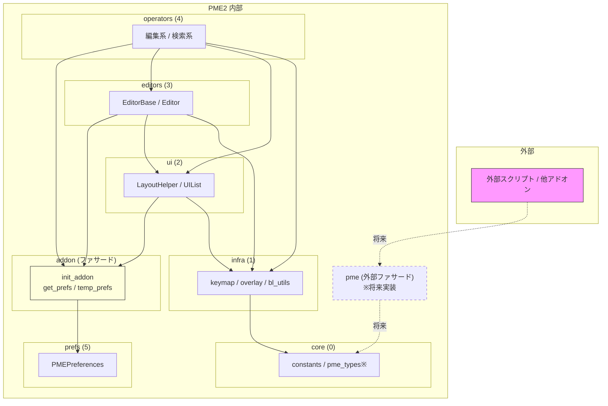

# rules/architecture.md

## 1. レイヤ構造（目標）

下に行くほど「土台」側。依存は上位→下位のみ許可。

```
prefs      (5) ← 最上位：アドオン設定、全体のハブ
operators  (4) ← 編集・検索・ユーティリティ系オペレーター
editors    (3) ← 各モード（PMENU/RMENU/DIALOG等）のエディタロジック
ui         (2) ← LayoutHelper, UIList, menus, popups
infra      (1) ← Blender 依存の基盤（pme.context, overlay, keymap）
core       (0) ← 最下位：Blender 非依存のロジック・データ構造
```

### 各レイヤの責務

| レイヤ | 責務 | 配置すべきもの |
|--------|------|---------------|
| `core/` | Blender 非依存のロジック | データモデル、パーサー、ユーティリティ関数 |
| `infra/` | Blender API との橋渡し | `pme.context`, `overlay`, `keymap_helper`, `bl_utils` |
| `ui/` | UI 描画ヘルパー | `LayoutHelper`, `UIList`, menus, popups |
| `editors/` | エディタロジック | `ed_*.py` の Editor クラス |
| `operators/` | オペレーター | 編集系・検索系・ユーティリティ系 |
| `prefs/` | アドオン設定 | `PMEPreferences`, 設定 UI |

## 2. 依存方向のルール

### 許可される依存（上位 → 下位）

```
prefs     → operators, editors, ui, infra, core
operators → editors, ui, infra, core
editors   → ui, infra, core
ui        → infra, core
infra     → core
core      → (なし)
```

### 禁止される依存（下位 → 上位）

- `core` → 他のすべてのレイヤ
- `infra` → `ui`, `editors`, `operators`, `prefs`
- `ui` → `editors`, `operators`, `prefs`
- `editors` → `operators`, `prefs`
- `operators` → `prefs`

### 例外

- `TYPE_CHECKING` ブロック内の import は依存違反としてカウントしない
- `prefs` から下位レイヤへの参照は許可（`prefs` は全体のハブなので）

### 違反検出

- `debug_utils.py` の `detect_layer_violations()` で自動検出
- `DBG_DEPS=True` で起動時にレイヤ違反を警告表示

## 3. モジュールローダー（Phase 1 完了）

### ✅ 新ローダー実装済み

Phase 1 で新ローダーが実装され、動作しています。

```python
# __init__.py (USE_PME2_LOADER=True の場合)
from . import addon

def on_context():
    addon.init_addon(
        module_patterns=PME2_MODULE_PATTERNS,
        use_reload=False,
    )
    addon.register_modules()
```

### `init_addon()` の処理フロー

1. `collect_modules()`: module_patterns に基づいてモジュールを収集
2. `load_modules()`: 各モジュールをロード（必要に応じてリロード）
3. `sort_modules()`: import 文と PropertyGroup 依存を解析 → トポロジカルソート
4. `MODULE_NAMES` に格納

### デバッグフラグ

| フラグ | 出力内容 |
|--------|---------|
| `DBG_DEPS=True` | レイヤ違反一覧、Mermaid 形式の依存グラフ |
| `DBG_PROFILE=True` | 各フェーズの所要時間 |
| `DBG_STRUCTURED=True` | NDJSON 形式のログ |

### レガシーローダー（互換用）

```python
# __init__.py (USE_PME2_LOADER=False の場合)
MODULES = ("addon", "pme", "c_utils", ...)  # 手動順序
get_classes()  # PropertyGroup 依存を解決
```

### `force_order` の扱い

- **デバッグ専用**：循環依存で詰んだときの逃げ道
- `pme2-dev` にマージする前に必ず **空にする**
- `force_order` が空でない = 設計負債

## 4. 現状のフラット構造からの移行

### Phase 1: 安全なファイルから移動 ✅ 完了

| 対象 | 移動先 | 状態 |
|------|--------|------|
| `constants.py` | `core/constants.py` | ✅ 完了 |
| `debug_utils.py` | `infra/debug.py` | ✅ 完了 |
| `layout_helper.py` | `ui/layout.py` | ✅ 完了 |
| `ui.py` (一部) | `ui/lists.py`, `ui/panels.py` | ✅ 完了 |
| `ed_*.py` | `editors/` | ✅ 完了 |

### Phase 2: UI & Editor 基盤の整理（次フェーズ）

| 対象 | 作業内容 | リスク |
|------|----------|--------|
| `WM_UL_pm_list`, `PME_UL_pm_tree` | 責務分離 | 中 |
| `EditorBase` | ui 層依存の削減 | 中 |
| `pme.props` / `ParsedData` | core 寄せ検討 | 中 |

### Phase 3: Runtime Lifecycle（将来）

| 対象 | 作業内容 | リスク |
|------|----------|--------|
| `operators/` (runtime 系) | Reload 対応 | 高 |
| `preferences.py` | 依存削減 | 高 |

詳細は `.claude/rules/milestones.md` を参照。

### 移動手順

1. 新ディレクトリに `__init__.py` を作成
2. 対象クラス/関数を新ファイルにコピー
3. 旧ファイルから `from .new_location import SomeClass` で再エクスポート
4. テスト通過後、旧ファイルの実装を削除

## 5. prefs / addon / pme の役割と依存関係

PME2 では、3 つの重要なモジュールがそれぞれ異なる役割を担います。

### 5.1 prefs の役割

`prefs` レイヤ（`PMEPreferences`）は「Blender UI にぶら下がる設定保存場所」です。

- Blender の `AddonPreferences` を継承
- PM/PMI データ、ユーザー設定、UI 状態を保持
- **下位レイヤから直接 import してはならない**

**禁止される理由**:
- `PMEPreferences` の内部構造に直接依存すると、設計変更時の影響範囲が広がる
- 循環依存の原因になりやすい

### 5.2 addon の役割（ホスト統合レイヤ）

`addon.py` は **ホスト統合レイヤ** として扱います。

**責務**:
- Blender アドオンのライフサイクル管理（`register` / `unregister`）
- `get_prefs()` / `temp_prefs()` などのファサード関数を提供
- モジュールローダー（`init_addon` / `register_modules`）

**依存ルール**:

| 依存パターン | 可否 | 備考 |
|-------------|------|------|
| `operators → addon` | ✅ 許可 | ファサード経由 |
| `editors → addon` | ✅ 許可 | ファサード経由 |
| `ui → addon` | ✅ 許可 | ファサード経由 |
| `infra → addon` | ✅ 許可 | ファサード経由 |
| `core → addon` | ❌ 禁止 | core は Blender 非依存 |
| `addon → prefs` | ✅ 許可 | ファサード実装のため |
| `prefs → addon` (ランタイム) | ❌ 禁止 | 循環依存の原因 |
| `prefs → addon` (TYPE_CHECKING) | ✅ 許可 | 型ヒントのみ |

### 5.3 pme の役割（外部向けファサード）— 将来目標

> **注意**: pme 外部 API の設計は完了していますが、**実装は凍結中**です。
> 内部構造（物理的モジュール分割）が安定するまで、API 実装は行いません。
> 詳細は `rules/api/pme_api_plan.md` を参照。

`pme.py` は **将来的に** 外部向けファサードとして再構成する予定です。

**将来の責務**:
- 外部スクリプト・他アドオンからの公式エントリポイント
- `pme.execute()` / `pme.evaluate()` などの実行 API
- 内部構造（`preferences`, `pme_types` など）の隠蔽

**現状の課題**:
- 現在の `pme.py` には `PMEContext`, `PMEProps`, `ParsedData` などの内部実装が混在
- これらは物理的モジュール分割の一環として `core/` 層に移動予定
- **Post v2.0.0** で対応予定

**依存ルール**:

| 依存パターン | 可否 | 備考 |
|-------------|------|------|
| 外部スクリプト → `pme` | ✅ 推奨 | 公式エントリポイント |
| 他アドオン → `pme` | ✅ 推奨 | 公式エントリポイント |
| `operators → pme` | ⚠️ 将来禁止 | 内部は `addon` 経由 |
| `editors → pme` | ⚠️ 将来禁止 | 内部は `addon` 経由 |
| `ui → pme` | ⚠️ 将来禁止 | 内部は `addon` 経由 |
| `infra → pme` | ⚠️ 将来禁止 | 内部は `addon` 経由 |
| `core → pme` | ❌ 禁止 | core は外部 API に依存しない |

**将来の方向性**:
1. 現在の `pme.py` の内部実装（`PMEContext` など）を `core/pme_context.py` に移動
2. `pme.py` は純粋なファサードモジュールに再構成
3. 外部からは `from pie_menu_editor import pme` を入口として使う

### 5.4 ファサードを使う理由

```python
# 推奨: ファサード経由（内部モジュールから）
from . import addon
prefs = addon.get_prefs()

# 推奨: 外部向けファサード（外部スクリプト/他アドオンから）
from pie_menu_editor import pme
pme.execute("bpy.ops.mesh.primitive_cube_add()")

# 非推奨: 直接 import
from .preferences import PMEPreferences
prefs = PMEPreferences.get()  # 直接参照は避ける
```

**メリット**:
1. **テスト容易性**: ファサードをモック可能にすることで、`prefs` なしで下位レイヤをテストできる
2. **依存の局所化**: `prefs` の内部構造が変わっても、ファサードのインターフェースを維持すれば影響範囲を限定できる
3. **レイヤ違反の防止**: 下位レイヤ → `prefs` の直接依存を禁止し、循環依存を防ぐ

### 5.5 型依存の回避（Protocol / string annotation）

下位レイヤ（`core` / `infra`）で `prefs` の型を直接参照しないため、以下の方針を採用します。

**方針: 迷ったら string annotation と Protocol で逃がす**

```python
# core/some_module.py

# ❌ 禁止: prefs の型を直接 import
from ..preferences import PMEPreferences
def do_something(prefs: PMEPreferences): ...

# ✅ 許可: TYPE_CHECKING 内で string annotation
from typing import TYPE_CHECKING
if TYPE_CHECKING:
    from ..preferences import PMEPreferences

def do_something(prefs: "PMEPreferences"): ...

# ✅ 推奨: Protocol で必要なインターフェースのみ定義
from typing import Protocol

class HasPieMenus(Protocol):
    pie_menus: dict[str, Any]

def do_something(prefs: HasPieMenus): ...
```

**使い分け**:

| ケース | 推奨方法 |
|--------|---------|
| 型ヒントのみ必要 | `TYPE_CHECKING` + string annotation |
| メソッド/属性の一部だけ必要 | `Protocol` を定義 |
| DTO としてデータを渡す | 独自の dataclass / TypedDict を定義 |

### 5.6 ランタイム import と TYPE_CHECKING の区別

**重要**: 「`prefs → addon` 禁止」「下位レイヤ → `prefs` 禁止」は **ランタイム import の話に限定** します。

```python
# prefs (preferences.py)

# ❌ 禁止: ランタイムで addon を import
from . import addon  # 循環依存の原因

# ✅ 許可: TYPE_CHECKING 内での import
from typing import TYPE_CHECKING
if TYPE_CHECKING:
    from . import addon
```

**ルールまとめ**:

| import の種類 | 許可/禁止 | 備考 |
|--------------|----------|------|
| ランタイム import (下位 → 上位) | ❌ 禁止 | 実行時に循環依存が発生 |
| `TYPE_CHECKING` 内 import | ✅ 許可 | 型チェック時のみ評価 |
| string annotation (`"SomeClass"`) | ✅ 許可 | 実行時には文字列のまま |

### 5.7 現状と移行計画

現状、多くのモジュールが `preferences.py` を直接 import しています。
これを段階的に `addon` ファサード経由に移行します。

| フェーズ | 作業 |
|----------|------|
| Phase 2-A (alpha.1) ✅ | 現状の依存パターンを観測・文書化 |
| Phase 2-B/C (alpha.2/3) | **物理的モジュール分割**（最優先） |
| Phase 3 (beta) | `editors` / `operators` のファサード移行 |
| RC | 直接依存を削除 or 許容範囲として文書化 |
| Post v2.0 | `pme.py` を純粋な外部ファサードに再構成（API 実装） |

> **重要**: pme 外部 API の実装は **Post v2.0.0** に延期。
> まずは物理的モジュール分割を優先する。

## 6. モジュール間の依存関係図



**凡例**:
- 実線: 現在許可されている依存
- 点線: 将来実装予定
- `addon` は特殊な位置づけで、全ての内部レイヤからアクセス可能
- `pme` 外部ファサードは **Post v2.0.0** で実装予定
