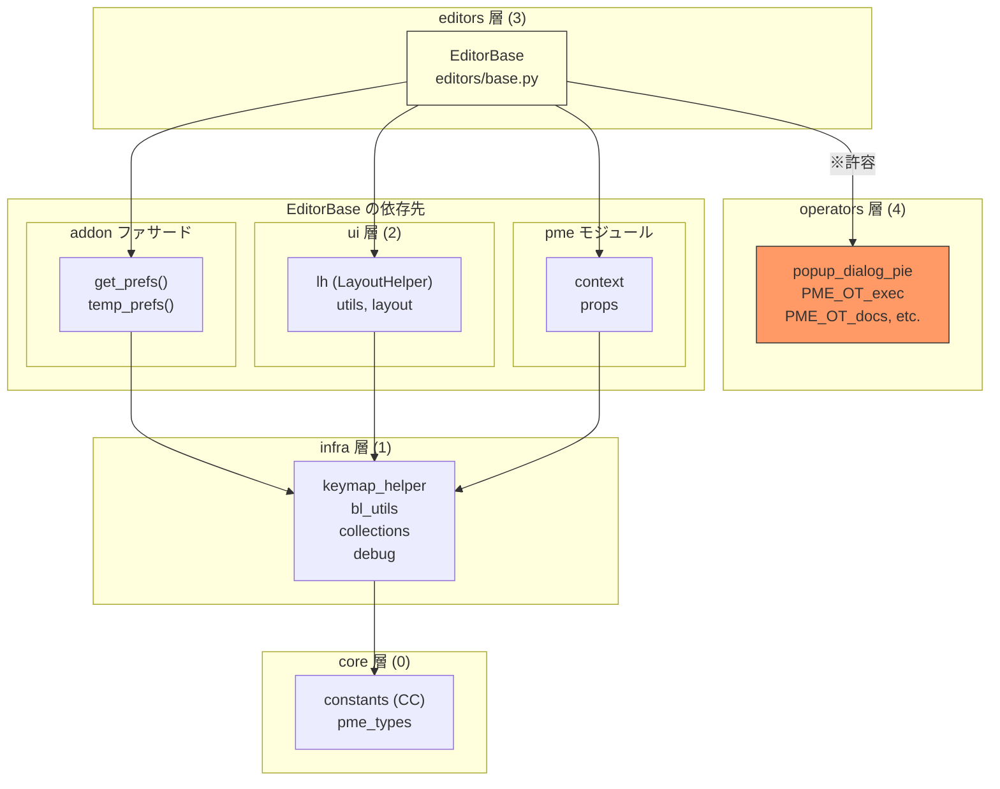

# Editor 依存関係マップ

Phase 2-A の観測結果。`EditorBase` と各 Editor の依存関係を整理する。

---

## Editor 一覧

| ファイル | クラス | モード ID | 用途 |
|---------|--------|----------|------|
| `editors/base.py` | `EditorBase` | - | 基底クラス |
| `editors/pie_menu.py` | `Editor` | `PMENU` | Pie Menu エディタ |
| `editors/menu.py` | `Editor` | `RMENU` | Regular Menu エディタ |
| `editors/popup.py` | `Editor` | `DIALOG` | Pop-up Dialog エディタ |
| `editors/panel_group.py` | `Editor` | `PANEL` | Side Panel エディタ |
| `editors/hpanel_group.py` | `Editor` | `HPANEL` | Hiding Unused Panels エディタ |
| `editors/property.py` | `Editor` | `PROPERTY` | Property エディタ |
| `ed_sticky_key.py` | `Editor` | `STICKY` | Sticky Key エディタ (旧パス) |
| `ed_stack_key.py` | `Editor` | `SCRIPT` | Stack Key エディタ (旧パス) |
| `ed_macro.py` | `Editor` | `MACRO` | Macro Operator エディタ (旧パス) |
| `ed_modal.py` | `Editor` | `MODAL` | Modal Operator エディタ (旧パス) |

---

## EditorBase の依存関係

`editors/base.py` のインポート一覧:

```python
# core 層
from ..core import constants as CC
from ..core.constants import MAX_STR_LEN, EMODE_ITEMS

# infra 層
from .. import keymap_helper as KH
from .. import keymap_helper
from ..infra.debug import *
from ..bl_utils import (
    find_context, re_operator, re_prop, re_prop_path, bp,
    message_box, uname, ConfirmBoxHandler, PME_OT_message_box,
)
from ..infra.collections import (
    sort_collection, AddItemOperator, MoveItemOperator, RemoveItemOperator,
)

# ui 層
from ..ui import (
    tag_redraw, shorten_str, gen_prop_name, gen_op_name, find_enum_args, utitle,
)
from ..ui import screen as SU
from ..ui.utils import get_pme_menu_class, toggle_menu, pme_menu_classes
from ..ui.layout import lh, operator, split, draw_pme_layout, L_SEP, L_LABEL

# model 層 (将来の core 候補)
from ..pme_types import Tag, PMItem, PMIItem
from ..property_utils import to_py_value

# pme 層 (infra)
from .. import pme

# utils (分類未定)
from .. import utils as U
from .. import operator_utils

# prefs 層 (via addon)
from ..addon import get_prefs, temp_prefs, ic_rb, ic_cb, ic_eye, ic_fb, ic

# operators 層
from ..operators import (
    popup_dialog_pie, PME_OT_exec, PME_OT_docs, PME_OT_preview,
    PME_OT_debug_mode_toggle, PME_OT_pm_hotkey_remove, WM_OT_pm_select,
    PME_OT_pm_search_and_select, PME_OT_script_open, WM_OT_pme_user_pie_menu_call,
)
```

### 依存図



**凡例**:
- `※許容`: `editors → operators` は現状許容（将来インターフェース分離を検討）

---

## レイヤ違反の分析

### 1. `editors → operators` (許容)

```python
from ..operators import (
    popup_dialog_pie, PME_OT_exec, PME_OT_docs, ...
)
```

- `architecture.md` では `editors → operators` は禁止とされている
- しかし、Editor は Operator の描画ヘルパーを使う必要がある
- **判断**: 現状は許容。将来的には Operator のインターフェースを分離検討

### 2. `editors → prefs` (via `addon.get_prefs()`)

```python
from ..addon import get_prefs, temp_prefs, ...
```

```python
# EditorBase.__init__
def __init__(self):
    get_prefs().editors[self.id] = self  # editors への自己登録
```

- Editor が自身を `PMEPreferences.editors` に登録
- `get_prefs()` 経由のアクセスは許容されるが、直接書き込みは問題

**問題点**:
- `PMEPreferences.editors` は Editor のレジストリ
- 本来は `addon` 層でレジストリを管理すべき

**改善案**:
```python
# addon.py
def register_editor(editor):
    _editors[editor.id] = editor

# EditorBase.__init__
def __init__(self):
    addon.register_editor(self)
```

### 3. `editors → pme.props` (モジュールレベル)

```python
# editors/pie_menu.py:15-18
pme.props.IntProperty("pm", "pm_radius", -1)
pme.props.IntProperty("pm", "pm_confirm", -1)
pme.props.IntProperty("pm", "pm_threshold", -1)
pme.props.BoolProperty("pm", "pm_flick", True)
```

- **モジュールロード時**にプロパティを登録
- Reload Scripts 問題の根本原因
- `pme.props.prop_map` への副作用

**問題点**:
- `register()` / `unregister()` のライフサイクル外で副作用
- Reload 時に `prop_map` がクリアされず不整合

**改善案 (Phase 3)**:
```python
# editors/pie_menu.py
def register():
    pme.props.IntProperty("pm", "pm_radius", -1)
    ...
    Editor()

def unregister():
    pme.props.unregister_type("pm")
```

---

## 各 Editor の追加依存

### `editors/pie_menu.py`

```python
from .base import EditorBase
from ..core.constants import ARROW_ICONS
from .. import pme
from ..addon import ic, get_prefs
from ..ui.layout import lh
```

**依存**: 最小限。`EditorBase` 継承 + 基本的な依存のみ。
**レイヤ違反**: なし

### `editors/menu.py`

```python
from .base import (EditorBase, PME_OT_pmi_edit, ...)
from ..bl_utils import PME_OT_input_box
from ..addon import get_prefs, ic_eye
from ..ui.layout import lh, Col
from ..ui import tag_redraw, shorten_str
from ..core.constants import SPACER_SCALE_Y, SEPARATOR_SCALE_Y
from .. import pme
```

**依存**: `EditorBase` からのオペレーター、`bl_utils` のダイアログ
**レイヤ違反**: なし

### `editors/popup.py`

```python
from .base import (EditorBase, ...)
from ..addon import get_prefs, ic, ic_cb, ic_eye
from ..core import constants as CC
from ..ui.layout import lh, draw_pme_layout, Row
from ..ui import tag_redraw, shorten_str
from ..infra.collections import MoveItemOperator, move_item, remove_item
from ..infra.debug import *
from ..bl_utils import PME_OT_message_box, ConfirmBoxHandler, enum_item_idx
from ..operators import popup_dialog_pie, WM_OT_pme_user_pie_menu_call
from ..keymap_helper import CTRL, SHIFT, ALT, OSKEY, test_mods
from .. import pme
```

**依存**: 最も多い。`keymap_helper` の修飾キー定数を使用。
**レイヤ違反**: なし

### `editors/panel_group.py`

```python
from ..core import constants as CC
from ..infra.collections import MoveItemOperator
from .base import EditorBase, PME_OT_pm_edit, PME_OT_pm_add
from ..addon import get_prefs, ic, ic_cb
from ..ui.layout import lh, operator, draw_pme_layout
from ..ui import utitle, tag_redraw
from ..ui.utils import draw_menu
from ..bl_utils import bl_context
from ..operators import (PME_OT_pm_hotkey_remove, ...)
from ..extra_operators import PME_OT_clipboard_copy
from ..ui import panels as PAU
from ..ui.panels import (pm_has_panels, ...)
from .. import pme
```

**依存**: パネル操作のため `ui/panels.py` への依存が多い。
**レイヤ違反**: なし

### `editors/hpanel_group.py`

```python
from .base import EditorBase
from ..addon import get_prefs, temp_prefs, SAFE_MODE
from ..ui.layout import lh
from ..ui import panels as PAU
from ..ui import tag_redraw
from ..operators import *
```

**依存**: `operators` から `*` でインポート（非推奨パターン）
**レイヤ違反**: `from ..operators import *` は依存の不明確化

### `editors/property.py`

```python
from .. import pme
from .base import (EditorBase, ...)
from ..infra.debug import *
from ..addon import get_prefs, temp_prefs
from ..ui.layout import lh
from ..ui import tag_redraw, shorten_str
from ..bl_utils import uname
from ..extra_operators import PME_OT_popup_property
from ..infra.collections import MoveItemOperator
from .. import operator_utils
from ..core import constants as CC
```

**依存**: 標準的な依存パターン
**レイヤ違反**: なし

---

## 絶対に触りたくない領域 (runtime/modal)

以下は Phase 3 以降まで変更禁止:

### keymap 関連

- `keymap_helper.py`: `KeymapHelper`, `Hotkey`, `_KMList*`
- ホットキー登録・解除のライフサイクル
- `CTRL`, `SHIFT`, `ALT`, `OSKEY` 定数

### runtime オペレーター

- `WM_OT_pme_user_pie_menu_call`: Pie Menu 呼び出し
- `PME_OT_modal_*`: Modal オペレーター群
- `PME_OT_sticky_key_*`: Sticky Key オペレーター
- `PME_OT_mouse_state_*`, `PME_OT_key_state_*`: 状態管理

### context 操作

- `BlContext`, `ContextOverride`, `PMEContext`
- `context.override()` 呼び出し
- handler / timer 登録

---

## infra/ui に落としたい依存の候補

### 1. `EditorBase.register_temp_prop()` / `register_pm_prop()` / `register_pmi_prop()`

```python
def register_temp_prop(self, id, prop):
    tpr = temp_prefs()
    setattr(tpr.ed_props.__class__, id, prop)

def register_pm_prop(self, id, prop):
    setattr(PMItem, id, prop)

def register_pmi_prop(self, id, prop):
    setattr(PMIItem, id, prop)
```

- 動的プロパティ登録
- `pme_types` (model) への依存
- **移動先候補**: `infra/property_registry.py`

### 2. UI 描画ヘルパー (`draw_*` メソッド群)

`EditorBase` の描画メソッドは `ui/editor_ui.py` などに分離可能:

- `draw_extra_settings()`
- `draw_items()`
- `draw_item()`
- `draw_pmi_menu_btn()`

### 3. `extend_panel()` / `unextend_panel()`

```python
# editors/base.py:114-150
def extend_panel(pm):
    tp = getattr(bpy.types, tp_name, None)
    if tp:
        tp.append(EXTENDED_PANELS[pm.name])
```

- Blender パネルへの動的追加
- **移動先候補**: `infra/panel_extension.py`

---

## pme.props 登録箇所一覧

各エディタでのモジュールレベル `pme.props.*Property()` 呼び出し:

| ファイル | 登録プロパティ |
|---------|---------------|
| `editors/pie_menu.py:15-18` | `pm_radius`, `pm_confirm`, `pm_threshold`, `pm_flick` |
| `editors/menu.py:600` | `rm_title` |
| `editors/popup.py:1649-1706` | `layout`, `width`, `poll`, `fixed_col`, `fixed_but`, `align`, `column`, `pd_row`, `pd_box`, `pd_panel`, `pd_expand` |
| `editors/panel_group.py:683-687` | `pg_wicons`, `pg_context`, `pg_category`, `pg_space`, `pg_region` |
| `ed_modal.py:25-27` | `confirm`, `block_ui`, `lock` |
| `ed_stack_key.py:5-6` | `s_undo`, `s_state` |
| `ed_sticky_key.py:48` | `sk_block_ui` |

**Phase 3 タスク**: これらを `register()` 関数内に移動

---

## 参照

- `editors/base.py`: `EditorBase` の実装
- `editors/*.py`: 各 Editor の実装
- `pme.py`: `PMEContext`, `PMEProps`, `ParsedData`
- `rules/architecture.md`: レイヤ構造の定義
- `rules/milestones.md`: フェーズ計画
