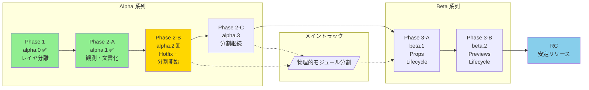

# rules/milestones.md

PME2 開発のマイルストーンとフェーズ定義。

---

## 基本方針

### PME1 と PME2 の関係

| ブランチ | 目的 | 状態 |
|----------|------|------|
| `main` / `pme1-lts` | PME1 安定版 (Blender 4.x) | **安定済み・Hotfix のみ** |
| `pme2-dev` | PME2 開発版 (Blender 5.0+) | **アクティブ開発中** |

- **PME1 への還元は行わない**: pme2-dev の成果は PME2 専用
- **リリース計画**: pme2-dev → プレリリース → ユーザーからの安定報告 → 正式リリース

### 開発の焦点

**物理的モジュール分割** を最優先とする。

| 優先度 | 作業 | 状態 |
|--------|------|------|
| 🔴 最優先 | 物理的モジュール分割（`infra/`, `ui/`, etc.） | 進行中 |
| 🟡 次点 | Reload Scripts の安定化 | Hotfix 済み、正式対応は Phase 3 |
| 🟢 長期目標 | pme 外部 API 設計 | 設計文書のみ、実装は凍結 |

**新ローダー (`init_addon` / `register_modules`) をコンパスとして使用**:
- `DBG_DEPS=True` でレイヤ違反を可視化
- 違反を削減しながらモジュールを分離していく
- 詳細は `rules/cleanup_workflow.md` を参照

---

## v2.0.0-alpha.0 (Phase 1: Layer Separation) ✅ COMPLETED

**目標**: 内部構造の可視化とレイヤ分離の土台作り

### 完了した作業

- [x] 新ローダー (`init_addon` / `register_modules`) の実装
- [x] レイヤ構造の定義: `core → infra → ui → editors → operators → prefs`
- [x] デバッグインフラの整備 (`DBG_DEPS`, `DBG_PROFILE`, 構造化ログ)
- [x] 一部モジュールの新パッケージへの移動
  - `core/constants.py`
  - `infra/debug.py`
  - `ui/layout.py`, `ui/lists.py`, `ui/panels.py`
  - `editors/` 配下 (各エディタ)
- [x] 旧モジュールからの薄いラッパー（後方互換性維持）
- [x] インポートパスの正規化

### 未完了（Phase 2 へ繰り越し）

- [ ] `infra/overlay.py` の作成（初期計画にあったが漏れ）
- [ ] `utils/helpers.py` の作成（PreviewsHelper 等は lifecycle 問題があり保留）

### ローダー構成

現在、2 つのローダーが共存しています：

| フラグ | ローダー | 説明 |
|--------|----------|------|
| `USE_PME2_LOADER = False` | 旧ローダー | `MODULES` タプル + `get_classes()` による手動順序管理 |
| `USE_PME2_LOADER = True` | 新ローダー | `init_addon()` + `register_modules()` による自動依存解決 |

α 系列では両方を共存させながら、漸進的に新ローダーへ移行します。旧ローダーの削除は RC フェーズで実施予定。

### 成果物

- レイヤ違反 49 件の可視化
- 54 モジュールの線形ロード順序
- register/unregister の両方で新ローダーが動作

---

## v2.0.0-alpha.1 (Phase 2-A: Observation) ✅ COMPLETED

**目標**: UI リスト・Editor 基盤・pme API の **現状を「観測」し、文書化する**

### 成果物

- `rules/ui_list_analysis.md` — UI リストの責務分析 ✅
- `rules/editor_dependency_map.md` — Editor の依存関係マップ ✅
- `rules/api/pme_api_current.md` — pme モジュールの現状インベントリ ✅

---

## v2.0.0-alpha.2 (Phase 2-B: Reload Hotfix + Module Separation) ⏳ IN PROGRESS

**目標**:
1. Reload Scripts の「即死級」問題をホットフィックスで抑える ✅
2. **物理的モジュール分割を加速する**（本フェーズの主要作業）
3. pme 外部 API の仕様を文書化する（実装は凍結）

### Reload Scripts ホットフィックス ✅ 完了

**Issue #64 (ParsedData / props)** ✅:
- [x] `ParsedData.__getattr__()` でフォールバックデフォルト値を返す
- [x] 警告ログで問題箇所を追跡可能にした

**Issue #65 (previews / icons)** ✅:
- [x] `refresh()` と `unregister()` に try-except ガードを追加
- [x] `ph.unregister()` 呼び出しをコメントアウト

### 物理的モジュール分割（主要タスク） ⏳

**新ローダーをコンパスに使い、レイヤ違反を削減しながら分割を進める。**

| 対象 | 移動先 | 状態 | リスク |
|------|--------|------|--------|
| `Overlay`, `Painter`, `Text`, etc. | `infra/overlay.py` | ✅ 完了 | 低 |
| 旧 `ed_*.py` のラッパー整理 | - | ✅ 確認済み (7/11 移行済み) | 低 |
| `from ..operators import *` の明示化 | - | ✅ 完了 | 低 |

**手順**:
1. `DBG_DEPS=True` でレイヤ違反を確認
2. Low risk な違反から対処
3. テスト（有効化・基本操作・永続化）
4. 詳細は `rules/cleanup_workflow.md` を参照

### pme API 仕様文書化 ✅ 完了（実装は凍結）

- [x] `rules/api/pme_api_plan.md` で Stability level を文書化 ✅
- [x] `rules/api/pme_standard_namespace.md` で名前空間を定義 ✅

> **重要**: pme API の **実装は凍結**。内部構造が安定するまで設計文書のみを維持する。
> 実装は Phase 3 以降で、内部リファクタリングが十分に進んだ後に検討。

### 受け入れ基準

- [x] Reload Scripts でクラッシュしない ✅
- [x] `infra/overlay.py` が作成されている ✅
- [ ] Low risk なレイヤ違反が 3〜5 件削減されている

---

## v2.0.0-alpha.3 (Phase 2-C: Module Separation Continuation)

**目標**: 物理的モジュール分割の継続

Phase 2-B で着手したモジュール分割を継続し、主要なレイヤ違反を解消する。

### 計画タスク

| 対象 | 作業内容 | リスク |
|------|----------|--------|
| `infra/io.py` | IO 系オペレーター（import/export/backup）の分離 | 低〜中 |
| `operators/` の整理 | 編集系・検索系の分類 | 中 |
| `pme_types.py` | `core/` への移動検討 | 中 |

### 受け入れ基準

- [ ] レイヤ違反が 40 件未満（Phase 1 時点: 49 件）
- [ ] 主要な `infra/` モジュールが整理されている

---

## v2.0.0-beta.1 (Phase 3-A: Runtime Lifecycle – Props & ParsedData)

**目標**: Reload Scripts の正式対応（Hotfix からの卒業）

### 計画タスク

- [ ] `pme.props.*Property()` をモジュールレベルから `register()` 内に移動
- [ ] `ParsedData` キャッシュのライフサイクル管理
- [ ] ライフサイクル設計を `rules/runtime_lifecycle.md` (新設) に文書化

### 受け入れ基準

- [ ] Reload Scripts 実行後も、Pie データのパースと実行が一貫して動作する

---

## v2.0.0-beta.2 (Phase 3-B: Runtime Lifecycle – Previews & Handlers)

**目標**: previews / handlers / timers のライフサイクル整理

### 計画タスク

- [ ] `previews_helper` の正しい再初期化フロー
- [ ] ハンドラ / タイマー登録パターンの統一
- [ ] ライフサイクルポリシーを `rules/runtime_lifecycle.md` に追記

### 受け入れ基準

- [ ] Reload 前後で handlers / timers / previews に関するエラーが出ない

---

## v2.0.0-RC (Release Candidate)

**目標**: PME2 の安定リリース準備

### 前提条件

- Phase 1〜3 の全タスク完了
- Reload Scripts が安定動作
- レイヤ違反が許容範囲内

### 計画タスク

- [ ] 旧ローダー（`MODULES` タプル）の削除
- [ ] レイヤ違反の許容リストを文書化
- [ ] `core/` 層の最低限の自動テスト導入
- [ ] マイグレーションガイド (PME1 → PME2)

### リリースプロセス

1. RC タグを作成
2. プレリリースとして公開
3. ユーザーからの安定報告を収集
4. 重大な問題がなければ正式リリース

---

## Post v2.0.0 (将来計画)

v2.0.0 リリース後の計画。

### pme 外部 API の実装

> **注意**: 設計文書は Phase 2-B で完了済み。実装は v2.0.0 リリース後に検討。

内部構造が安定した後に、以下を実装検討:

- `pme.execute()` / `pme.evaluate()` の実装
- `pme.find_pm()` / `pme.invoke_pm()` の実装
- Stability level の Stable 昇格（v2.1.0 以降）

詳細は `rules/api/pme_api_plan.md` を参照。

### pme モジュールの再構成

**目標**: `pme.py` を純粋な「外部向けファサード」に再構成する

1. `PMEContext`, `PMEProps`, `ParsedData` を `core/` 層に移動
2. `pme.py` を薄いファサードに変更
3. 内部モジュールは `addon` 経由でアクセス

### パフォーマンス最適化

- 大量のパイメニュー時の起動速度改善
- PropertyGroup の遅延初期化
- キャッシュ戦略の見直し

---

## フェーズ間の関係図



### フェーズの方針

| フェーズ | 方針 | 主要作業 |
|----------|------|---------|
| alpha.1 ✅ | 観測 | 文書化 |
| alpha.2 ⏳ | 分割開始 | `infra/overlay.py` 作成、Low risk 違反修正 |
| alpha.3 | 分割継続 | `infra/io.py`、`operators/` 整理 |
| beta.1 | Lifecycle | props 登録タイミング修正 |
| beta.2 | Lifecycle | previews/handlers 整理 |
| RC | 整理 | 旧ローダー削除、テスト整備 |

---

## 新ローダーをコンパスとして使う

物理的モジュール分割の進捗は、新ローダーのレイヤ違反検出で測定する。

### 使い方

```bash
# Blender 起動時に自動出力、または
python .claude/scripts/analyze_deps_log.py
```

### 目標

| フェーズ | 違反数目標 | 備考 |
|----------|-----------|------|
| Phase 1 完了時 | 49 件 | 初期測定値 |
| alpha.3 完了時 | < 40 件 | 10 件以上削減 |
| beta 完了時 | < 30 件 | 主要違反を解消 |
| RC | 許容リスト化 | 残りは文書化して許容 |

詳細は `rules/cleanup_workflow.md` を参照。
