# rules/milestones.md

PME2 開発のマイルストーンとフェーズ定義。

---

## 基本方針

### PME1 と PME2 の関係

| ブランチ | 目的 | 状態 |
|----------|------|------|
| `main` / `pme1-lts` | PME1 安定版 (Blender 4.x) | **安定済み・Hotfix のみ** |
| `pme2-dev` | PME2 開発版 (Blender 5.0+) | **アクティブ開発中** |

- **PME1 への還元は行わない**: pme2-dev の成果は PME2 専用
- **リリース計画**: pme2-dev → プレリリース → ユーザーからの安定報告 → 正式リリース

### 開発の焦点

**ライフサイクル整備** を最優先とする。core 層の設計は、ライフサイクルが安定してから着手する。

| 優先度 | 作業 | 状態 |
|--------|------|------|
| 🔴 最優先 | ライフサイクル整備（Reload Scripts 正式対応） | Phase 3 で開始予定 |
| 🟡 次点 | 物理的モジュール分割（`infra/`, `ui/`, etc.） | Phase 2 で大幅進捗 |
| 🟢 長期目標 | core 層分離 / pme 外部 API | ライフサイクル安定後 |

### 進め方の原則

**「バグの原因を一つに限定できる進め方」** を選ぶ。

- ライフサイクルが安定するまで core には手を出さない
- 複数の変更を同時に行わない（問題発生時の切り分けを容易にする）
- 各フェーズは明確なゲート条件を持つ

**新ローダー (`init_addon` / `register_modules`) をコンパスとして使用**:
- `DBG_DEPS=True` でレイヤ違反を可視化
- 違反を削減しながらモジュールを分離していく
- 詳細は `rules/cleanup_workflow.md` を参照

---

## v2.0.0-alpha.0 (Phase 1: Layer Separation) ✅ COMPLETED

**目標**: 内部構造の可視化とレイヤ分離の土台作り

### 完了した作業

- [x] 新ローダー (`init_addon` / `register_modules`) の実装
- [x] レイヤ構造の定義: `core → infra → ui → editors → operators → prefs`
- [x] デバッグインフラの整備 (`DBG_DEPS`, `DBG_PROFILE`, 構造化ログ)
- [x] 一部モジュールの新パッケージへの移動
  - `core/constants.py`
  - `infra/debug.py`
  - `ui/layout.py`, `ui/lists.py`, `ui/panels.py`
  - `editors/` 配下 (各エディタ)
- [x] 旧モジュールからの薄いラッパー（後方互換性維持）
- [x] インポートパスの正規化

### 未完了（Phase 2 へ繰り越し）

- [ ] `infra/overlay.py` の作成（初期計画にあったが漏れ）
- [ ] `utils/helpers.py` の作成（PreviewsHelper 等は lifecycle 問題があり保留）

### ローダー構成

現在、2 つのローダーが共存しています：

| フラグ | ローダー | 説明 |
|--------|----------|------|
| `USE_PME2_LOADER = False` | 旧ローダー | `MODULES` タプル + `get_classes()` による手動順序管理 |
| `USE_PME2_LOADER = True` | 新ローダー | `init_addon()` + `register_modules()` による自動依存解決 |

α 系列では両方を共存させながら、漸進的に新ローダーへ移行します。旧ローダーの削除は RC フェーズで実施予定。

### 成果物

- レイヤ違反 49 件の可視化
- 54 モジュールの線形ロード順序
- register/unregister の両方で新ローダーが動作

---

## v2.0.0-alpha.1 (Phase 2-A: Observation) ✅ COMPLETED

**目標**: UI リスト・Editor 基盤・pme API の **現状を「観測」し、文書化する**

### 成果物

- `rules/ui_list_analysis.md` — UI リストの責務分析 ✅
- `rules/editor_dependency_map.md` — Editor の依存関係マップ ✅
- `rules/api/pme_api_current.md` — pme モジュールの現状インベントリ ✅

---

## v2.0.0-alpha.2 (Phase 2-B: Reload Hotfix + Module Separation) ✅ COMPLETED

**目標**:
1. Reload Scripts の「即死級」問題をホットフィックスで抑える ✅
2. **物理的モジュール分割を加速する**（本フェーズの主要作業）
3. pme 外部 API の仕様を文書化する（実装は凍結）

### Reload Scripts ホットフィックス ✅ 完了

**Issue #64 (ParsedData / props)** ✅:
- [x] `ParsedData.__getattr__()` でフォールバックデフォルト値を返す
- [x] 警告ログで問題箇所を追跡可能にした

**Issue #65 (previews / icons)** ✅:
- [x] `refresh()` と `unregister()` に try-except ガードを追加
- [x] `ph.unregister()` 呼び出しをコメントアウト

### 物理的モジュール分割（主要タスク） ✅ 完了

**新ローダーをコンパスに使い、レイヤ違反を削減しながら分割を進める。**

| 対象 | 移動先 | 状態 | リスク |
|------|--------|------|--------|
| `Overlay`, `Painter`, `Text`, etc. | `infra/overlay.py` | ✅ 完了 | 低 |
| 旧 `ed_*.py` のラッパー整理 | - | ✅ 確認済み (7/11 移行済み) | 低 |
| `from ..operators import *` の明示化 | - | ✅ 完了 | 低 |
| LAYER 定数追加（27 モジュール） | - | ✅ 完了 | 低 |
| ファサードモジュール例外処理 | `infra/debug.py` | ✅ 完了 | 低 |
| extra_operators.py 解体 | `operators/extras/` | ✅ 完了 | 低 |
| Script/Hotkey オペレーター | `operators/script.py`, `operators/hotkey.py` | ✅ 完了 | 低 |

**達成した違反削減**: **46 件 → 23 件** (50% 削減)

**operators/ パッケージの分割状況**:
- `operators/__init__.py`: 3400+ 行 → 2588 行（812行削減）
- 7 サブモジュール + 1 サブパッケージ（extras/）に分離
- 37 クラスを整理（全体約178クラス中の約21%）

**手順**:
1. `DBG_DEPS=True` でレイヤ違反を確認
2. Low risk な違反から対処
3. テスト（有効化・基本操作・永続化）
4. 詳細は `rules/cleanup_workflow.md` を参照

### pme API 仕様文書化 ✅ 完了（実装は凍結）

- [x] `rules/api/pme_api_plan.md` で Stability level を文書化 ✅
- [x] `rules/api/pme_standard_namespace.md` で名前空間を定義 ✅

> **重要**: pme API の **実装は凍結**。内部構造が安定するまで設計文書のみを維持する。
> 実装は Phase 3 以降で、内部リファクタリングが十分に進んだ後に検討。

### 受け入れ基準

- [x] Reload Scripts でクラッシュしない ✅
- [x] `infra/overlay.py` が作成されている ✅
- [x] Low risk なレイヤ違反が 3〜5 件削減されている ✅ (24件削減)

---

## v2.0.0-alpha.3 (Phase 2-C: Module Separation Continuation)

**目標**: 物理的モジュール分割の継続と残り22件の違反整理

Phase 2-B で達成した違反削減（46→22件）を維持しつつ、残りの違反を分析・整理する。

### 残存する違反の分類（22件）

| カテゴリ | 件数 | 説明 | 対処方針 |
|----------|------|------|----------|
| `core` 違反 | ~8件 | `pme_types`, `constants` が上位層を import | Phase 3 で対処 |
| `editors → operators` | ~4件 | ボタン等で operators を使う | 許容可能、ドキュメント化 |
| `infra ↔ ui` | ~6件 | `bl_utils`, `base` が `screen` を import | 整理検討 |
| その他 | ~4件 | `preferences` 等 | 要分析 |

### 計画タスク

| 対象 | 作業内容 | リスク | 状態 |
|------|----------|--------|------|
| `infra/io.py` | IO 系ユーティリティの分離 | 低〜中 | ✅ 完了 |
| ユーザーリソースパス | `bpy.utils.user_resource()` 対応 | 低 | ✅ 完了 |
| デュアルパス検索 | scripts/icons のシステム+ユーザー検索 | 低 | ✅ 完了 |
| 違反の許容リスト作成 | 意図的に許容する違反をドキュメント化 | 低 | - |
| `operators/` の整理 | 編集系・検索系の分類 | 中 | - |
| `pme_types.py` | `core/` への移動検討 | 中 | - |

### 完了した作業

**`infra/io.py` 作成** ✅:
- ファイル I/O ユーティリティ（read_import_file, write_export_file, BackupManager）
- ユーザーリソースパス関数（get_user_config_dir, get_user_scripts_dir, get_user_icons_dir, etc.）
- システムリソースパス関数（get_system_scripts_dir, get_system_icons_dir）
- デュアルパスイテレータ（iter_script_dirs）

**ユーザーリソース管理** ✅:
- バックアップ: `{user_config}/backups/` に保存（アップデート後も維持）
- エクスポート: `{user_config}/exports/` をデフォルトに
- スクリプト: システム→ユーザーの順で検索、ユーザーが拡張可能
- アイコン: システム→ユーザーの順で読み込み、ユーザーがオーバーライド可能
- UI のパス誘導も更新（path_open オペレーター）

### 受け入れ基準

- [x] レイヤ違反が 40 件未満（Phase 1 時点: 49 件）✅ **22件達成**
- [x] `infra/io.py` が作成されている ✅
- [x] ユーザーリソースが Blender 標準パスに保存される ✅
- [ ] 許容する違反が `rules/allowed_violations.md` に文書化されている
- [ ] `operators/` が整理されている

---

## v2.0.0-alpha.3 (Phase 3: Lifecycle Sprint) ⏳ NEXT

**目標**: ライフサイクル問題の正式対応（Hotfix からの卒業）

### ゲート条件

**以下の全シナリオが安定動作するまで core には手を出さない**:
- Reload Scripts（F3 → Reload Scripts）
- アドオンの ON/OFF（Preferences での有効化/無効化）
- Blender 再起動

### 計画タスク

| タスク | 説明 | 状態 |
|--------|------|------|
| `use_reload` パターン導入 | `"addon" in locals()` での reload 検知 | - |
| props 登録の移動 | モジュールレベル → `register()` 内に移動 | - |
| ParsedData クリアポイント | キャッシュの適切なライフサイクル管理 | - |
| handler/timer クリアポイント | 登録解除の確実な実行 | - |
| ライフサイクル設計文書 | `rules/runtime_lifecycle.md` 新設 | - |

### `use_reload` パターン（参考: modular_renamer）

```python
use_reload = "addon" in locals()
if use_reload:
    import importlib
    importlib.reload(locals()["addon"])
    del importlib

from . import addon

addon.init_addon(...)
```

### 受け入れ基準

- [ ] Reload Scripts 実行後も全機能が動作
- [ ] アドオン ON/OFF 繰り返しでエラーなし
- [ ] Blender 再起動後も設定が維持される
- [ ] `rules/runtime_lifecycle.md` が作成されている

---

## v2.0.0-beta.1 (Phase 4-A: Core Layer – Props & Context)

**目標**: pme.py の内部実装を core 層に分離

> **前提条件**: Phase 3 のゲート条件をすべてクリアしていること

### 計画タスク

- [ ] `PMEContext` を `core/executor.py` に移動
- [ ] `PMEProps`, `ParsedData` を `core/` に移動
- [ ] `pme.py` を薄いファサードに変更

### 受け入れ基準

- [ ] core 層が Blender 依存を最小化
- [ ] ライフサイクルシナリオが引き続き安定動作

---

## v2.0.0-beta.2 (Phase 4-B: Core Layer – Namespace & Integration)

**目標**: 標準名前空間と外部 API の基盤整備

### 計画タスク

- [ ] `core/namespace.py` に標準名前空間を定義
- [ ] `pme.execute()` / `pme.evaluate()` のファサード実装
- [ ] 外部ツールからの利用シナリオを検証

### 受け入れ基準

- [ ] 外部スクリプトから `pme.execute()` が動作
- [ ] ライフサイクルシナリオが引き続き安定動作

---

## v2.0.0-RC (Release Candidate)

**目標**: PME2 の安定リリース準備

### 前提条件

- Phase 1〜3 の全タスク完了
- Reload Scripts が安定動作
- レイヤ違反が許容範囲内

### 計画タスク

- [ ] 旧ローダー（`MODULES` タプル）の削除
- [ ] レイヤ違反の許容リストを文書化
- [ ] `core/` 層の最低限の自動テスト導入
- [ ] マイグレーションガイド (PME1 → PME2)

### リリースプロセス

1. RC タグを作成
2. プレリリースとして公開
3. ユーザーからの安定報告を収集
4. 重大な問題がなければ正式リリース

---

## Post v2.0.0 (将来計画)

v2.0.0 リリース後の計画。

### pme 外部 API の実装

> **注意**: 設計文書は Phase 2-B で完了済み。実装は v2.0.0 リリース後に検討。

内部構造が安定した後に、以下を実装検討:

- `pme.execute()` / `pme.evaluate()` の実装
- `pme.find_pm()` / `pme.invoke_pm()` の実装
- Stability level の Stable 昇格（v2.1.0 以降）

詳細は `rules/api/pme_api_plan.md` を参照。

### pme モジュールの再構成

**目標**: `pme.py` を純粋な「外部向けファサード」に再構成する

1. `PMEContext`, `PMEProps`, `ParsedData` を `core/` 層に移動
2. `pme.py` を薄いファサードに変更
3. 内部モジュールは `addon` 経由でアクセス

### パフォーマンス最適化

- 大量のパイメニュー時の起動速度改善
- PropertyGroup の遅延初期化
- キャッシュ戦略の見直し

### Import パターンの整理

**目標**: `import X as Y` パターンを明示的な cherry-pick import に置き換え、モジュールをコンポーネント単位で明確に分離する。

```python
# Before
from . import utils as U
from ..core import constants as CC

# After
from .utils import specific_function
from ..core.constants import MAX_STR_LEN, EMODE_ITEMS
```

詳細は `rules/dependency_cleanup_plan.md` の「長期目標」セクションを参照。

---

## フェーズ間の関係図

```mermaid
flowchart LR
    subgraph Alpha["Alpha 系列"]
        P1["Phase 1<br/>alpha.0 ✅<br/>レイヤ分離"]
        P2A["Phase 2-A<br/>alpha.1 ✅<br/>観測・文書化"]
        P2B["Phase 2-B<br/>alpha.2 ✅<br/>Hotfix +<br/>分割完了"]
        P3["Phase 3<br/>alpha.3 ⏳<br/>Lifecycle<br/>Sprint"]
    end

    subgraph Beta["Beta 系列"]
        P4A["Phase 4-A<br/>beta.1<br/>Core Layer<br/>Props"]
        P4B["Phase 4-B<br/>beta.2<br/>Core Layer<br/>API"]
    end

    RC["RC<br/>安定リリース"]

    P1 --> P2A --> P2B --> P3 --> P4A --> P4B --> RC

    subgraph Gate["ゲート条件"]
        G[/"Lifecycle<br/>全シナリオ通過"/]
    end

    P3 -.-> G
    G -.-> P4A

    style P1 fill:#90EE90
    style P2A fill:#90EE90
    style P2B fill:#90EE90
    style P3 fill:#FFD700
    style G fill:#FF6B6B
    style RC fill:#87CEEB
```



### フェーズの方針

| フェーズ | 方針 | 主要作業 |
|----------|------|---------|
| alpha.0 ✅ | レイヤ分離 | 新ローダー、デバッグインフラ |
| alpha.1 ✅ | 観測 | 文書化 |
| alpha.2 ✅ | 分割完了 | `infra/overlay.py`, `operators/` 分割 |
| alpha.3 ⏳ | Lifecycle Sprint | use_reload, props 登録、クリアポイント |
| beta.1 | Core Layer | PMEContext, ParsedData を core に移動 |
| beta.2 | Core API | pme.execute() ファサード実装 |
| RC | 整理 | 旧ローダー削除、テスト整備 |

---

## 新ローダーをコンパスとして使う

物理的モジュール分割の進捗は、新ローダーのレイヤ違反検出で測定する。

### 使い方

```bash
# Blender 起動時に自動出力、または
python .claude/scripts/analyze_deps_log.py
```

### 目標

| フェーズ | 違反数目標 | 備考 |
|----------|-----------|------|
| Phase 1 完了時 | 49 件 | 初期測定値 |
| alpha.3 完了時 | < 40 件 | 10 件以上削減 |
| beta 完了時 | < 30 件 | 主要違反を解消 |
| RC | 許容リスト化 | 残りは文書化して許容 |

詳細は `rules/cleanup_workflow.md` を参照。
