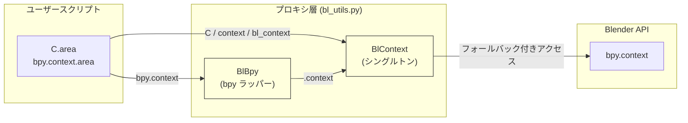
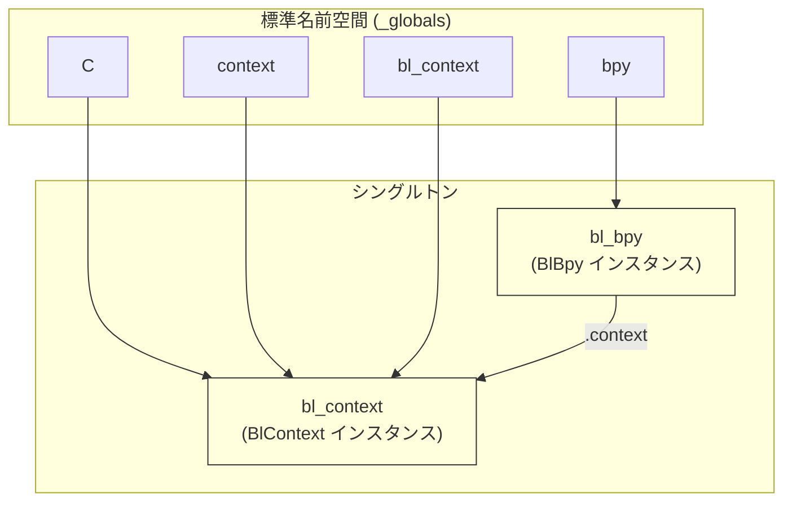
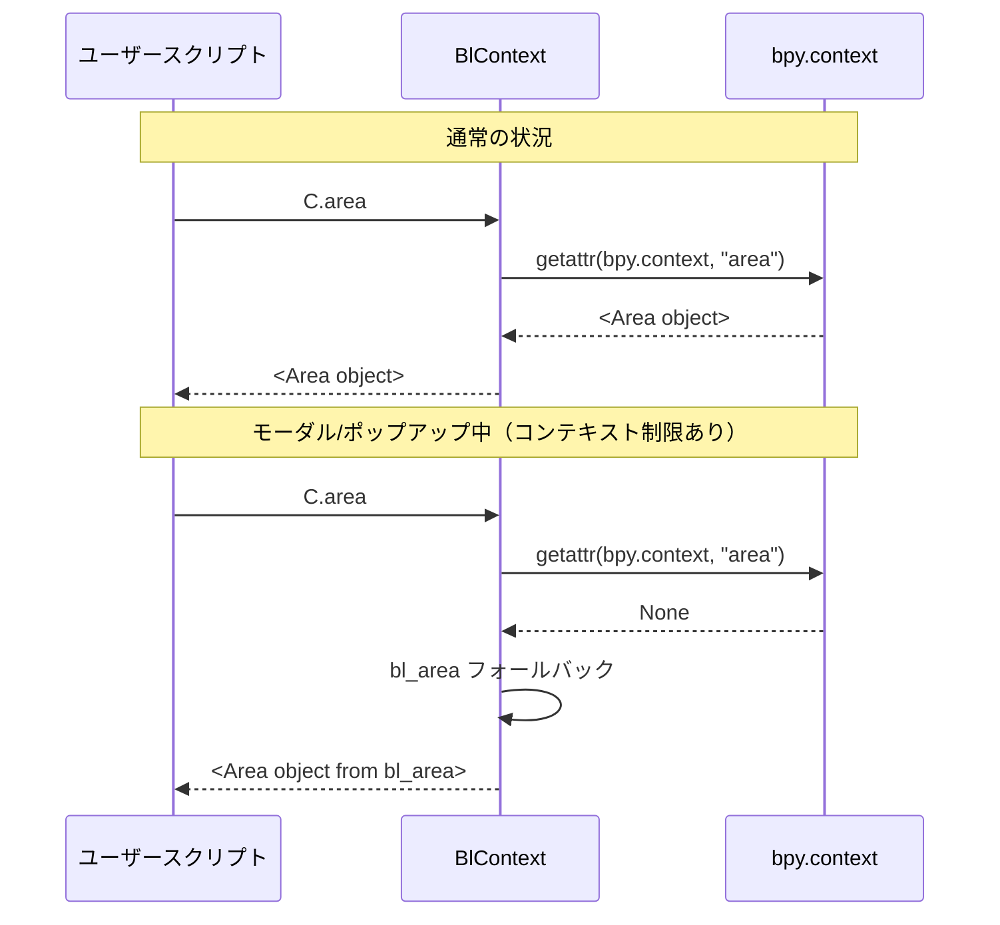
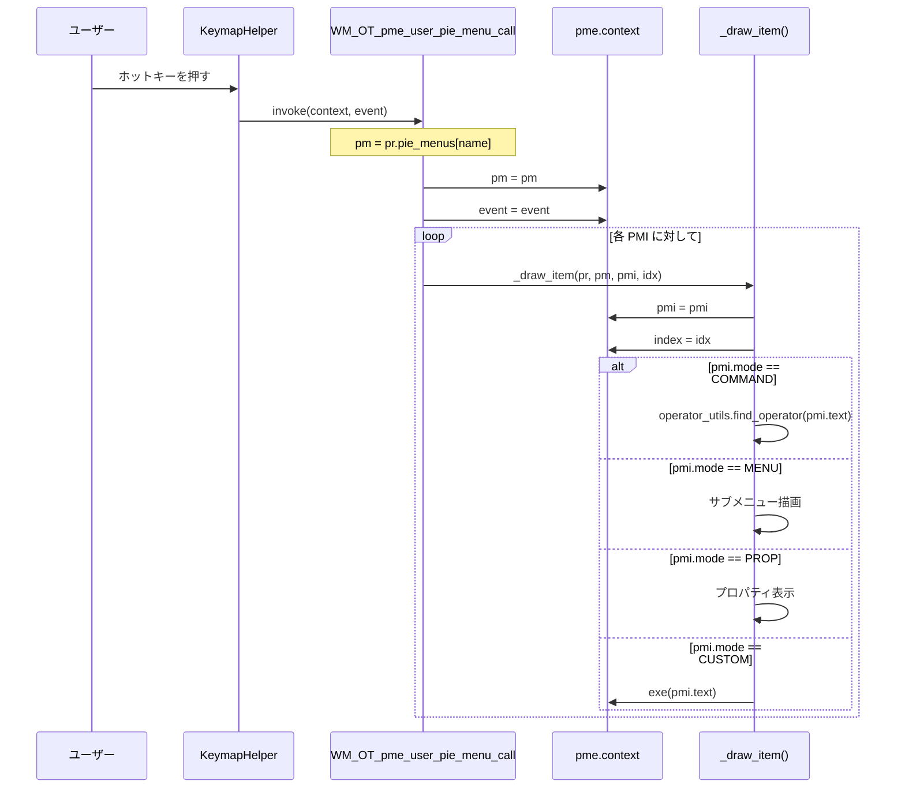
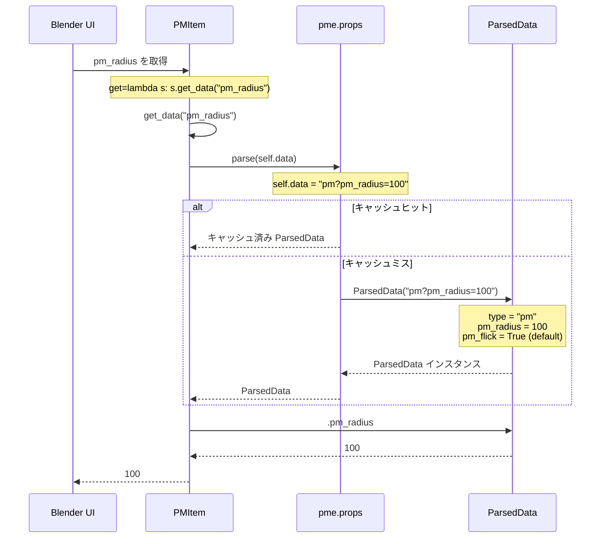
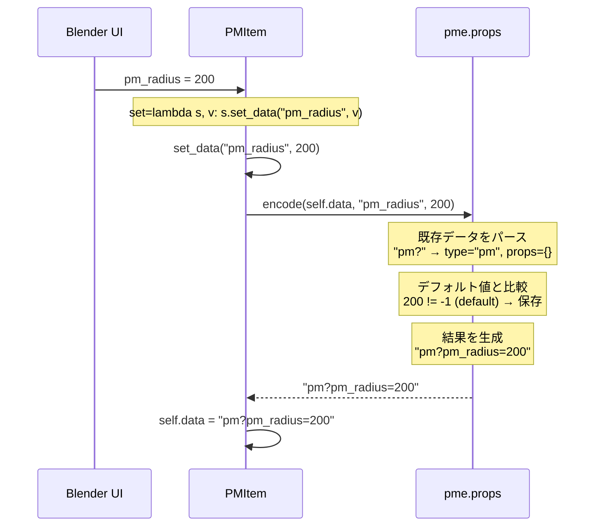
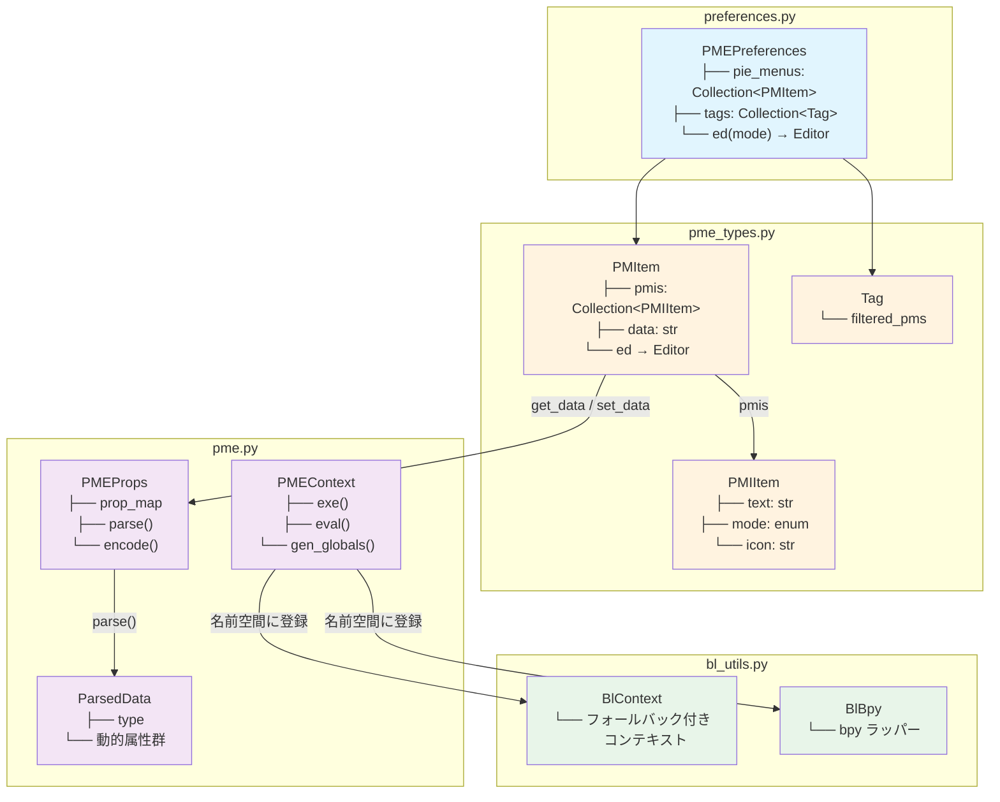
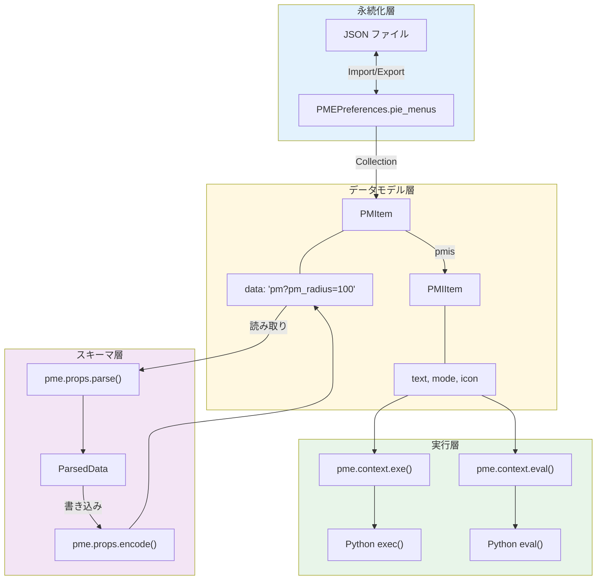
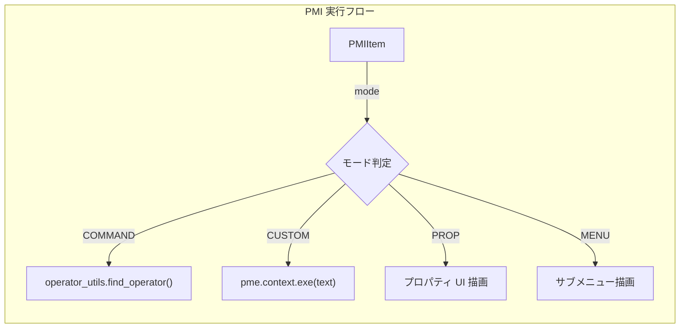
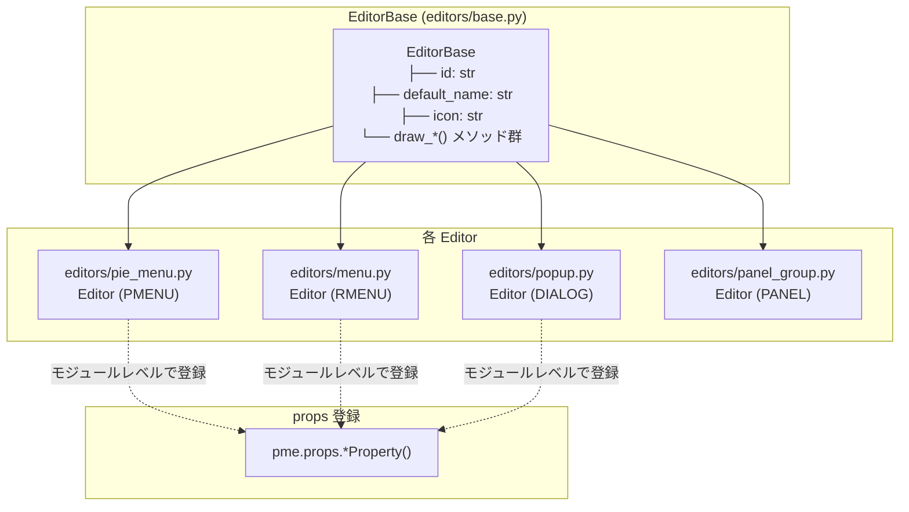

# PME Core Components Guide

pme API 設計のための、既存コンポーネントの理解ガイド。
各コンポーネントの責務、データフロー、使われ方を整理する。

---

## 目次

### 本編
1. [コンポーネント概観](#1-コンポーネント概観)
2. [PMEContext - 実行エンジン](#2-pmecontext---実行エンジン)
3. [PMEProps - スキーマ管理](#3-pmeprops---スキーマ管理)
4. [ParsedData - データパーサー](#4-parseddata---データパーサー)
5. [PMItem / PMIItem - データモデル](#5-pmitem--pmiitem---データモデル)
6. [標準名前空間](#6-標準名前空間)
7. [BlContext / BlBpy - コンテキストプロキシ](#7-blcontext--blbpy---コンテキストプロキシ)
8. [データフローの全体像](#8-データフローの全体像)
9. [コンポーネント間の依存関係](#9-コンポーネント間の依存関係)

### 付録
- [PMEProp](#付録-pmeprop) — プロパティメタデータ、type 一覧
- [PMI モード一覧](#付録-pmi-モード一覧) — COMMAND, CUSTOM, PROP 等
- [Editor システム](#付録-editor-システム) — EditorBase の役割
- [よく使われるパターン](#付録-よく使われるパターン) — コード内の頻出イディオム
- [用語集](#付録-用語集クイックリファレンス) — 略語・変数名の早見表

### 詳細解説サブページ
- [PMEProps スキーマシステム](./pmeprops-schema-system.md) — 詳細解説、dataclass 移行検討
- [EditorBase 分解計画](./editorbase-decomposition.md) — PME2 再設計提案、Schema/Behavior/View 分離
- [BlContext プロキシ](./blcontext-proxy.md) — コンテキストプロキシの分析と簡素化提案
- [Editor と PMItem の関係](./editor-pmitem-relationship.md) — データと振る舞いの分離パターン
- [**PME2 理想アーキテクチャ**](./ideal-architecture.md) — 再設計のビジョン、全体クラス図

---

## 1. コンポーネント概観

### 1.1 主要コンポーネント一覧

| コンポーネント | ファイル | 責務 |
|---------------|----------|------|
| **PMEContext** | `pme.py` | Python コードの実行、グローバル名前空間の管理 |
| **PMEProps** | `pme.py` | プロパティスキーマの登録、データ文字列のパース/エンコード |
| **ParsedData** | `pme.py` | パース結果を属性としてアクセス可能にするオブジェクト |
| **PMEProp** | `pme.py` | 個別プロパティのメタデータ（型、デフォルト値） |
| **PMItem** | `pme_types.py` | Pie Menu 本体（Blender PropertyGroup） |
| **PMIItem** | `pme_types.py` | Pie Menu Item（Blender PropertyGroup） |
| **UserData** | `pme.py` | ユーザースクリプト用の変数コンテナ |
| **Tag** | `pme_types.py` | タグによるフィルタリング機能 |
| **PMLink** | `pme_types.py` | ツリー表示用のリンク構造 |
| **BlContext** | `bl_utils.py` | `bpy.context` のプロキシ、フォールバック付きアクセス |
| **BlBpy** | `bl_utils.py` | `bpy` モジュールのラッパー（`.context` を BlContext に転送） |

### 1.2 グローバルインスタンス

```python
# pme.py で定義されるシングルトン
context = PMEContext()   # 実行コンテキスト
props = PMEProps()       # プロパティスキーマ管理

# bl_utils.py で定義されるシングルトン
bl_context = BlContext() # Blender コンテキストのプロキシ
bl_bpy = BlBpy()         # bpy モジュールのラッパー
```

これらは `pme.context`, `pme.props` としてアドオン全体からアクセスされる。
`bl_context`, `bl_bpy` は標準名前空間の `C`, `context`, `bpy` として利用される。

---

## 2. PMEContext - 実行エンジン

### 2.1 概要

`PMEContext` は PME の **実行エンジン** である。ユーザーが定義した Python コードを、適切な名前空間内で実行する。

### 2.2 主要属性

```python
class PMEContext:
    def __init__(self):
        # グローバル名前空間（基本セット）
        self._globals = dict(
            bpy=bpy,
            pme_context=self,
            drag_x=0,
            drag_y=0,
        )

        # 現在の実行対象
        self.pm = None          # 現在の PMItem
        self.pmi = None         # 現在の PMIItem
        self.index = None       # 現在の PMI インデックス

        # UI 描画用
        self._layout = None     # UILayout
        self._event = None      # Event
        self.region = None      # Region
        self.is_first_draw = True

        # アイテム情報
        self.icon = None
        self.icon_value = None
        self.text = None

        # 実行状態
        self.exec_globals = None
        self.exec_locals = None
        self.exec_user_locals = dict()  # ユーザー定義のローカル変数
```

### 2.3 主要メソッド

#### `exe(data, globals=None, use_try=True) → bool`

Python コードを実行する。

```python
def exe(self, data, globals=None, menu=None, slot=None, use_try=True):
    if globals is None:
        globals = self.gen_globals()

    if not use_try:
        exec(data, globals)
        return True

    try:
        exec(data, globals)
    except:
        print_exc(data)
        return False

    return True
```

**使用例**:
```python
# ユーザーが定義したスクリプトを実行
pme.context.exe("bpy.ops.mesh.primitive_cube_add()")
```

#### `eval(expression, globals=None) → Any`

式を評価して結果を返す。

```python
def eval(self, expression, globals=None, menu=None, slot=None):
    if globals is None:
        globals = self.gen_globals()

    value = None
    try:
        value = eval(expression, globals)
    except:
        print_exc(expression)

    return value
```

**使用例**:
```python
# poll 条件を評価
result = pme.context.eval("C.mode == 'EDIT_MESH'")
```

#### `gen_globals(**kwargs) → dict`

実行用のグローバル名前空間を生成する。

```python
def gen_globals(self, **kwargs):
    ret = dict(
        text=self.text,
        icon=self.icon,
        icon_value=self.icon_value,
        PME=temp_prefs(),      # 一時設定
        PREFS=get_prefs(),     # アドオン設定
        **kwargs
    )

    ret.update(self.exec_user_locals)  # ユーザー定義変数
    ret.update(self.globals)           # 基本グローバル + D

    return ret
```

#### `add_global(key, value)`

グローバル名前空間に変数を追加する。

```python
def add_global(self, key, value):
    self._globals[key] = value

# 使用例（addon register 時）
context.add_global("U", UserData())
```

### 2.4 プロパティ（setter 付き）

#### `layout` プロパティ

```python
@layout.setter
def layout(self, value):
    self._layout = value
    self._globals["L"] = value  # L 変数にも設定
```

#### `event` プロパティ

```python
@event.setter
def event(self, value):
    self._event = value
    self._globals["E"] = value  # E 変数にも設定

    if self._event:
        if self._event.type == 'WHEELUPMOUSE':
            self._globals["delta"] = 1
        elif self._event.type == 'WHEELDOWNMOUSE':
            self._globals["delta"] = -1
```

---

## 3. PMEProps - スキーマ管理

### 3.1 概要

`PMEProps` は **プロパティスキーマの管理** を担当する。各エディタが定義するプロパティを登録し、データ文字列のパース/エンコードを行う。

### 3.2 クラス構造

```python
class PMEProps:
    prop_map = {}  # クラス変数: 全プロパティ定義を保持

    def __init__(self):
        self.parsed_data = {}  # インスタンス変数: パース結果のキャッシュ
```

### 3.3 プロパティ登録メソッド

```python
def IntProperty(self, type, name, default=0):
    self.prop_map[name] = PMEProp(type, name, default, 'INT')

def BoolProperty(self, type, name, default=False):
    self.prop_map[name] = PMEProp(type, name, default, 'BOOL')

def StringProperty(self, type, name, default=""):
    self.prop_map[name] = PMEProp(type, name, default, 'STR')

def EnumProperty(self, type, name, default, items):
    self.prop_map[name] = PMEProp(type, name, default, 'STR', items)
```

**登録例**（editors/pie_menu.py より）:
```python
pme.props.IntProperty("pm", "pm_radius", -1)
pme.props.IntProperty("pm", "pm_confirm", -1)
pme.props.BoolProperty("pm", "pm_flick", True)
```

### 3.4 parse(text) → ParsedData

データ文字列をパースして `ParsedData` を返す。結果はキャッシュされる。

```python
def parse(self, text):
    if text not in self.parsed_data:
        self.parsed_data[text] = ParsedData(text)

    pd = self.parsed_data[text]
    # 不足しているプロパティがあればデフォルト値を設定
    for k, prop in self.prop_map.items():
        if prop.type == pd.type and not hasattr(pd, k):
            setattr(pd, k, prop.default)

    return pd
```

### 3.5 encode(text, prop, value) → str

プロパティ値をデータ文字列にエンコードする。

```python
def encode(self, text, prop, value):
    tp, _, data = text.partition("?")

    # 既存のプロパティをパース
    data = data.split("&")
    lst = []
    has_prop = False

    for pr in data:
        if not pr:
            continue
        k, v = pr.split("=")
        if k not in props.prop_map:
            continue
        if k == prop:
            v = value
            has_prop = True
        if v != props.get(k).default:  # デフォルト値と異なる場合のみ保存
            lst.append("%s=%s" % (k, v))

    if not has_prop and value != props.prop_map[prop].default:
        lst.append("%s=%s" % (prop, value))

    lst.sort()
    return "%s?%s" % (tp, "&".join(lst))
```

---

## 4. ParsedData - データパーサー

### 4.1 概要

`ParsedData` は、データ文字列をパースした結果を **属性としてアクセス可能** にするオブジェクト。

### 4.2 データ文字列のフォーマット

```
"type?key1=value1&key2=value2"

例:
"pm?pm_radius=100&pm_flick=False"
 │   └──────────────┬────────────┘
 │                  │
 type (pm)          プロパティ（デフォルトと異なる値のみ）
```

### 4.3 初期化処理

```python
class ParsedData:
    def __init__(self, text):
        # 1. type を抽出
        self.type, _, data = text.partition("?")

        # 2. 該当 type の全プロパティにデフォルト値を設定
        for k, prop in props.prop_map.items():
            if prop.type == self.type:
                setattr(self, k, prop.default)

        # 3. データ文字列から値を上書き
        for prop in data.split("&"):
            if not prop:
                continue
            k, v = prop.split("=")
            if k in props.prop_map:
                setattr(self, k, props.prop_map[k].decode_value(v))

        # 4. 全プロパティがデフォルト値かどうかを判定
        self.is_empty = True
        for k, prop in props.prop_map.items():
            if hasattr(self, k) and getattr(self, k) != prop.default:
                self.is_empty = False
                break
```

### 4.4 属性アクセス

```python
# 使用例
pd = pme.props.parse("pm?pm_radius=100")
print(pd.type)       # "pm"
print(pd.pm_radius)  # 100
print(pd.pm_flick)   # True (デフォルト値)
```

### 4.5 value(name) メソッド

EnumProperty の場合に、選択肢の index を返す。

```python
def value(self, name):
    prop = props.get(name)
    if not prop:
        return 0

    current_value = getattr(self, name, prop.default)
    items = getattr(prop, "items", None)
    if not items:
        return 0

    for item in items:
        if current_value == item[0]:
            return item[2]  # index を返す

    return 0
```

---

## 5. PMItem / PMIItem - データモデル

### 5.1 PMItem（Pie Menu）

`PMItem` は **Pie Menu 本体** を表す Blender PropertyGroup。

#### 主要プロパティ

| プロパティ | 型 | 説明 |
|-----------|-----|------|
| `label` | StringProperty | メニュー名（getter/setter 付き） |
| `mode` | EnumProperty | モード（PMENU, RMENU, DIALOG, etc.） |
| `pmis` | CollectionProperty | メニューアイテムのコレクション |
| `data` | StringProperty | パース可能なデータ文字列 |
| `enabled` | BoolProperty | 有効/無効 |
| `tag` | StringProperty | タグ |
| `key`, `ctrl`, `shift`, `alt`, `oskey` | | ホットキー設定 |
| `km_name` | StringProperty | キーマップ名 |
| `poll_cmd` | StringProperty | poll 条件（Python コード） |

#### プロパティアクセス用のプロパティ

```python
# pm.pm_radius でデータにアクセス可能
pm_radius: bpy.props.IntProperty(
    get=lambda s: s.get_data("pm_radius"),
    set=lambda s, v: s.set_data("pm_radius", v),
    default=-1,
)

pm_flick: bpy.props.BoolProperty(
    get=lambda s: s.get_data("pm_flick"),
    set=lambda s, v: s.set_data("pm_flick", v),
)
```

#### get_data / set_data

```python
def get_data(self, key):
    value = getattr(pme.props.parse(self.data), key)
    return value

def set_data(self, key, value):
    self.data = pme.props.encode(self.data, key, value)
```

#### ed プロパティ

```python
@property
def ed(self):
    return get_prefs().ed(self.mode)  # 対応する Editor インスタンスを取得
```

### 5.2 PMIItem（Pie Menu Item）

`PMIItem` は **個別のメニューアイテム** を表す Blender PropertyGroup。

#### 主要プロパティ

| プロパティ | 型 | 説明 |
|-----------|-----|------|
| `mode` | EnumProperty | アイテムモード（COMMAND, MENU, PROP, etc.） |
| `text` | StringProperty | コマンド/スクリプト内容 |
| `icon` | StringProperty | アイコン名（フラグ付き） |
| `enabled` | BoolProperty | 有効/無効 |
| `label` | StringProperty | ラベル（getter/setter 付き） |

#### アイコンフラグ

```python
# icon プロパティにはフラグが埋め込まれる
# 例: "!@MESH_CUBE" → ! = icon_only, @ = hidden

def extract_flags(self):
    icon, icon_only, hidden, use_cb = U.extract_str_flags(
        self.icon, CC.F_ICON_ONLY, CC.F_HIDDEN, CC.F_CB
    )
    return icon, icon_only, hidden, use_cb
```

#### parse() メソッド

```python
def parse(self, default_icon='NONE'):
    icon, icon_only, hidden, use_cb = self.extract_flags()
    text = self.name

    if icon_only:
        text = ""
    if hidden:
        icon = 'NONE' if not icon or not icon_only else 'BLANK1'
        if text:
            text = " " * len(text)
    elif not icon:
        icon = default_icon

    return text, icon, oicon, icon_only, hidden, use_cb
```

---

## 6. 標準名前空間

### 6.1 概要

`pme.context.exe()` / `pme.context.eval()` で実行される Python コードには、**標準名前空間** の変数が自動的に提供される。

### 6.2 基本変数（_globals）

`PMEContext.__init__()` で設定される初期変数:

| 変数名 | 値 | 説明 |
|--------|-----|------|
| `bpy` | `bpy` module | Blender Python モジュール |
| `pme_context` | `self` | PMEContext インスタンス自身 |
| `drag_x` | `0` | ドラッグ X 座標 |
| `drag_y` | `0` | ドラッグ Y 座標 |

### 6.3 動的変数（gen_globals）

`gen_globals()` で追加される変数:

| 変数名 | 値 | 説明 |
|--------|-----|------|
| `text` | `self.text` | 現在の PMI のテキスト |
| `icon` | `self.icon` | 現在の PMI のアイコン名 |
| `icon_value` | `self.icon_value` | 現在の PMI のアイコン値 |
| `PME` | `temp_prefs()` | 一時設定オブジェクト |
| `PREFS` | `get_prefs()` | アドオン設定（PMEPreferences） |

### 6.4 プロパティ経由で設定される変数

| 変数名 | 設定タイミング | 説明 |
|--------|---------------|------|
| `L` | `context.layout = value` | UILayout |
| `E` | `context.event = value` | Event |
| `delta` | `context.event = value` | ホイールデルタ（1, -1, 0） |

### 6.5 register() で追加される変数

| 変数名 | 値 | 説明 |
|--------|-----|------|
| `U` | `UserData()` | ユーザー変数コンテナ |

### 6.6 他モジュールから追加される変数

`bl_utils.py`, `__init__.py` などで追加される変数:

| 変数名 | 実際の値 | 登録元 | 備考 |
|--------|----------|--------|------|
| `C` | `BlContext` | `bl_utils.py` | ⚠️ `bpy.context` ではなくプロキシ |
| `context` | `BlContext` | `bl_utils.py` | `C` と同じインスタンス |
| `bl_context` | `BlContext` | `bl_utils.py` | `C` と同じインスタンス |
| `bpy` | `BlBpy` | `bl_utils.py` | ⚠️ 本物の `bpy` ではなくラッパー |
| `D` | `bpy.data` | `__init__.py` / `PMEContext.globals` | |
| `T` | `bpy.types` | `__init__.py` | |
| `O` | `bpy.ops` | `__init__.py` | |
| `P` | `bpy.props` | `__init__.py` | |

> **重要**: `C`, `context`, `bl_context`, `bpy` はすべてプロキシ経由。詳細は [7. BlContext / BlBpy](#7-blcontext--blbpy---コンテキストプロキシ) を参照。

### 6.7 ユーザーが変数を追加する方法

```python
# 方法 1: add_global() を使用
pme.context.add_global("my_var", 42)

# 方法 2: exec_user_locals に追加
pme.context.exec_user_locals["my_var"] = 42

# 方法 3: UserData (U) を使用
U.my_var = 42  # スクリプト内で
```

---

## 7. BlContext / BlBpy - コンテキストプロキシ

### 7.1 概要

`BlContext` と `BlBpy` は、Blender のコンテキスト (`bpy.context`) に対する **プロキシパターン** を実装している。これにより、PME はモーダルオペレーターやポップアップなど、コンテキストが制限される状況でも安定して動作する。

**所在**: `bl_utils.py`



### 7.2 標準名前空間での登録

`bl_utils.py` の `register()` で、以下のように登録される：

```python
def register():
    bl_context.set_context(bpy.context)

    pme.context.add_global("C", bl_context)          # ← BlContext
    pme.context.add_global("context", bl_context)    # ← BlContext
    pme.context.add_global("bl_context", bl_context) # ← BlContext
    pme.context.add_global("bpy", bl_bpy)            # ← BlBpy (not bpy!)
```

**重要**: `C`, `context`, `bl_context` はすべて **同じ** `BlContext` インスタンスを指す。
そして `bpy` は実際の `bpy` モジュールではなく、`BlBpy` ラッパーを指す。



### 7.3 BlContext の責務

`BlContext` は `bpy.context` のプロキシとして、以下の機能を提供する：

#### フォールバック機能

```python
class BlContext:
    bl_area = None       # フォールバック用 Area
    bl_region = None     # フォールバック用 Region
    bl_space_data = None # フォールバック用 SpaceData

    def __getattr__(self, attr):
        # 1. まず実際の bpy.context から取得を試みる
        value = getattr(bpy.context, attr, None)

        # 2. 取得できなかった場合、フォールバック値を使用
        if not value:
            if attr == "region":
                value = BlContext.bl_region
            elif attr == "area":
                value = BlContext.bl_area
            # ...
```

#### 特殊な属性の解決

| 属性 | 解決方法 |
|------|---------|
| `area` | `bl_area` フォールバック |
| `region` | `bl_region` フォールバック |
| `space_data` | エリアスタックまたは `bl_space_data` |
| `material` | `active_object.active_material` |
| `brush` | `paint_settings(context).brush` |
| `bone` | `object.data.bones.active` |
| `edit_bone` | `object.data.edit_bones.active` |
| `pose_bone` | `context.active_pose_bone` |
| `material_slot` | `active_object.material_slots[...]` |
| `texture` | マテリアルまたはワールドのテクスチャ |

#### エリアスタック

```python
def use_area(self, area):
    """一時的に異なるエリアを使用"""
    self.areas.append(area)
    self.area_map[area] = get_space_data(area)

def restore_area(self):
    """エリアを元に戻す"""
    area = self.areas.pop()
    self.area_map.pop(area, None)
```

これにより、別のエリアのコンテキストで操作を実行できる。

### 7.4 BlBpy の責務

`BlBpy` は `bpy` モジュールのラッパーとして、`.context` アクセスを `BlContext` に転送する：

```python
class BlBpy:
    def __getattribute__(self, attr):
        if attr == "context":
            return bl_context  # ← BlContext を返す

        return getattr(bpy, attr, None)  # その他は本物の bpy から取得
```

**効果**: ユーザースクリプトで `bpy.context.area` と書いても、実際には `BlContext.__getattr__("area")` が呼ばれる。

### 7.5 なぜプロキシが必要か



**問題**: Blender のモーダルオペレーターやポップアップでは、`bpy.context` が制限され、`area` や `region` が `None` になることがある。

**解決**: `BlContext` は事前に保存したフォールバック値を返すことで、スクリプトが動作し続けるようにする。

### 7.6 reset() の役割

```python
def reset(self, context):
    """実行前にフォールバック値を設定"""
    BlContext.bl_area = context.area
    BlContext.bl_region = context.region
    BlContext.bl_space_data = context.space_data
```

これは Pie Menu の呼び出し時（`invoke()` など）に呼ばれ、現在のコンテキストをフォールバックとして保存する。

### 7.7 設計上の考慮事項

#### Core Layer との関係

`BlContext` / `BlBpy` は **infra 層** に属する。理由：

- Blender API (`bpy`) に強く依存
- コンテキストのライフサイクルに密結合
- UI 操作（エリア、リージョン）に関連

Core Layer を分離する際、これらは `infra/` に残すべき。

#### 将来の改善候補

1. **reset() の呼び出し箇所の明確化**: 現在、複数箇所で呼ばれており追跡が困難
2. **エリアスタックの改善**: 現在はリストベースだが、コンテキストマネージャーパターンが望ましい
3. **テスト容易性**: `BlContext` をモック可能にすることで、単体テストが可能に

---

## 8. データフローの全体像

### 8.1 メニュー呼び出しの流れ



### 8.2 データ読み書きの流れ

#### 読み取り（get）



#### 書き込み（set）



### 8.3 poll 条件の評価

```
PMItem.poll(cls, context)
        │
        │  poll_cmd が DEFAULT_POLL でない場合
        ▼
┌─────────────────────────────────────────┐
│  poll_method_co = self.poll_methods[self.name]              │
│                                                              │
│  exec_globals = pme.context.gen_globals()                   │
│  exec_globals.update(menu=self.name)                        │
│                                                              │
│  pme.context.exe(poll_method_co, exec_globals)              │
│                                                              │
│  return exec_globals["poll"](cls, bl_context)               │
└─────────────────────────────────────────┘
```

---

## 9. コンポーネント間の依存関係

### 9.1 依存関係図



### 9.2 データの流れ方向



**レイヤの責務**:

| レイヤ | 責務 | 主要コンポーネント |
|--------|------|-------------------|
| **永続化層** | JSON との入出力、Blender 設定への保存 | `PMEPreferences`, `WM_OT_pm_import/export` |
| **データモデル層** | メニュー構造の保持 | `PMItem`, `PMIItem`, `Tag` |
| **スキーマ層** | プロパティのパース/エンコード | `PMEProps`, `ParsedData` |
| **実行層** | Python コードの実行 | `PMEContext`, `BlContext` |

### 9.3 Editor との連携

```python
# PMItem.ed プロパティ
@property
def ed(self):
    return get_prefs().ed(self.mode)

# Editor がプロパティ定義を登録
# (editors/pie_menu.py)
pme.props.IntProperty("pm", "pm_radius", -1)

class Editor(EditorBase):
    id = "PMENU"
    default_name = "Pie Menu"
    icon = 'MESH_CIRCLE'
    # ...
```

---

## 付録: PMEProp

### 構造

```python
class PMEProp:
    def __init__(self, type, name, default, ptype='STR', items=None):
        self.name = name        # プロパティ名
        self.default = default  # デフォルト値
        self.items = items      # EnumProperty の選択肢
        self.type = type        # 所属する type (pm, rm, pd, etc.)
        self.ptype = ptype      # 値の型 (STR, BOOL, INT)

    def decode_value(self, value):
        """文字列から適切な型に変換"""
        if self.ptype == 'STR':
            return value
        elif self.ptype == 'BOOL':
            return value == "True" or value == "1"
        elif self.ptype == 'INT':
            return int(value) if value else 0
```

### type 一覧

| type | 対応モード | 主なプロパティ |
|------|-----------|---------------|
| `pm` | PMENU (Pie Menu) | pm_radius, pm_flick, pm_confirm |
| `rm` | RMENU (Regular Menu) | rm_title |
| `pd` | DIALOG (Popup Dialog) | pd_title, pd_box, pd_width |
| `row` | DIALOG (行設定) | align, size, fixed_col |
| `pg` | PANEL (Panel Group) | pg_context, pg_category |
| `mo` | MODAL | confirm, block_ui, lock |
| `s` | SCRIPT (Stack Key) | s_undo, s_state |
| `sk` | STICKY | sk_block_ui |
| `prop` | PROPERTY | vector, mulsel, exp |

---

## 付録: PMI モード一覧

PMIItem の `mode` プロパティが取りうる値と、その動作：

| モード | 定数 | 説明 | `text` の用途 |
|--------|------|------|--------------|
| **COMMAND** | `'COMMAND'` | オペレーター実行 | `bpy.ops.xxx()` 形式のコマンド |
| **CUSTOM** | `'CUSTOM'` | カスタムスクリプト | 任意の Python コード |
| **PROP** | `'PROP'` | プロパティ表示/編集 | `C.object.location` などのパス |
| **MENU** | `'MENU'` | サブメニュー | 他の PM の名前 |
| **HOTKEY** | `'HOTKEY'` | ホットキー実行 | キー名 |
| **OPERATOR** | `'OPERATOR'` | オペレーター（UI 設定付き） | オペレーター ID |
| **EMPTY** | `'EMPTY'` | 空のスロット | - |



---

## 付録: Editor システム

### EditorBase の役割

各メニューモード（PMENU, RMENU, DIALOG 等）には対応する **Editor** クラスがある。
Editor は `EditorBase` を継承し、以下を提供する：



### Editor と PMItem の関係

```python
# PMItem から Editor を取得
pm.ed  # → get_prefs().ed(pm.mode) → Editor インスタンス

# 使用例
pm.ed.icon        # Editor のアイコン
pm.ed.draw_item() # アイテムの描画
```

### Editor の登録

```python
# preferences.py
class PMEPreferences:
    editors = {}  # mode → Editor インスタンス

    def ed(self, mode):
        return self.editors.get(mode)

# editors/pie_menu.py
class Editor(EditorBase):
    id = "PMENU"
    # ...

def register():
    Editor()  # __init__ で自動登録
```

---

## 付録: よく使われるパターン

### 1. プロパティアクセスパターン

```python
# データ文字列を通じたプロパティアクセス
class PMItem:
    # Blender プロパティとして定義
    pm_radius: IntProperty(
        get=lambda s: s.get_data("pm_radius"),
        set=lambda s, v: s.set_data("pm_radius", v),
    )

# 内部では data 文字列をパース/エンコード
def get_data(self, key):
    return getattr(pme.props.parse(self.data), key)

def set_data(self, key, value):
    self.data = pme.props.encode(self.data, key, value)
```

### 2. グローバル名前空間の構築

```python
# 実行前に名前空間を準備
globals_dict = pme.context.gen_globals(
    extra_var=value,  # 追加変数
)

# 実行
pme.context.exe(code, globals=globals_dict)
```

### 3. コンテキストプロキシパターン

```python
# ユーザースクリプトでの C.area アクセス
C.area  # 実際には BlContext.__getattr__("area") が呼ばれる

# BlContext は以下の順で解決
# 1. bpy.context.area を試す
# 2. None なら bl_area フォールバックを返す
```

### 4. アイコンフラグパターン

```python
# icon 文字列にフラグを埋め込む
"!@MESH_CUBE"
# ! = icon_only (テキストなし)
# @ = hidden (非表示)

# 抽出
icon, icon_only, hidden, use_cb = U.extract_str_flags(
    pmi.icon, CC.F_ICON_ONLY, CC.F_HIDDEN, CC.F_CB
)
```

### 5. temp_prefs パターン

```python
# 一時的な設定（UI 状態など）
tpr = temp_prefs()
tpr.some_ui_state = value

# 永続設定
pr = get_prefs()
pr.some_saved_setting = value
```

---

## 付録: 用語集（クイックリファレンス）

| 用語 | 説明 |
|------|------|
| **PM** | Pie Menu（PMItem）の略。一つのメニュー全体 |
| **PMI** | Pie Menu Item（PMIItem）の略。メニュー内の一項目 |
| **pr** | `get_prefs()` の戻り値（PMEPreferences）の慣用変数名 |
| **tpr** | `temp_prefs()` の戻り値（一時設定）の慣用変数名 |
| **lh** | LayoutHelper のグローバルインスタンス |
| **pp** | `pme.props` の古い参照（非推奨、`pme.props` を使用） |
| **pd** | ParsedData インスタンスの慣用変数名 |
| **C** | BlContext インスタンス（bpy.context のプロキシ） |
| **D** | `bpy.data` |
| **E** | 現在の Event |
| **L** | 現在の UILayout |
| **U** | UserData インスタンス（ユーザー変数コンテナ） |
| **data 文字列** | `"type?key=value&..."` 形式のシリアライズ文字列 |
| **type** | data 文字列の先頭部分（pm, rm, pd など） |
| **prop_map** | `PMEProps.prop_map` - 全プロパティ定義を保持するクラス変数 |
| **parsed_data** | `PMEProps.parsed_data` - ParsedData のキャッシュ辞書 |

### ファイル略称

| 略称 | ファイル |
|------|---------|
| **CC** | `core/constants.py` |
| **KH** | `keymap_helper.py` |
| **SU** | `ui/screen.py` |
| **PAU** | `ui/panels.py` |
| **U** | `utils.py` |

---

## 参照

- `pme.py` — PMEContext, PMEProps, ParsedData
- `pme_types.py` — PMItem, PMIItem, Tag, PMLink
- `bl_utils.py` — BlContext, BlBpy（コンテキストプロキシ）
- `preferences.py` — PMEPreferences
- `editors/base.py` — EditorBase
- `.claude/rules/api/pme_api_current.md` — API インベントリ
- `.claude/rules/editor_dependency_map.md` — Editor 依存関係の詳細
