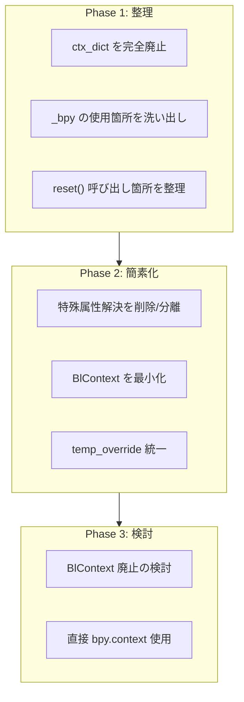

# BlContext / BlBpy コンテキストプロキシ

> 現状分析と簡素化提案

## 概要

`BlContext` と `BlBpy` は Blender のコンテキスト (`bpy.context`) に対するプロキシパターンを実装している。
モーダルオペレーターやポップアップなど、コンテキストが制限される状況での動作を保証するために設計された。

**所在**: `bl_utils.py`

---

## 現状の仕組み

### なぜ必要だったか

Blender ではモーダル実行中やポップアップ描画中に `bpy.context` の一部属性が `None` になる：

```python
# モーダル実行中
bpy.context.area    # → None
bpy.context.region  # → None
```

PME はユーザースクリプトを実行するため、これらが `None` だとスクリプトが壊れる。

### BlContext の解決策

```python
class BlContext:
    bl_area = None       # フォールバック用（クラス変数）
    bl_region = None
    bl_space_data = None

    def reset(self, context):
        """コンテキストが有効なうちに保存"""
        BlContext.bl_area = context.area
        BlContext.bl_region = context.region
        BlContext.bl_space_data = context.space_data

    def __getattr__(self, attr):
        # 1. まず本物の bpy.context から取得
        value = getattr(_bpy.context, attr, None)

        # 2. None ならフォールバック
        if not value:
            if attr == "area":
                value = BlContext.bl_area
            elif attr == "region":
                value = BlContext.bl_region
            # ... 他にも多数の特殊処理
```

### 標準名前空間への登録

```python
# bl_utils.py の register()
pme.context.add_global("C", bl_context)          # ← BlContext
pme.context.add_global("context", bl_context)    # ← BlContext
pme.context.add_global("bpy", bl_bpy)            # ← BlBpy (not bpy!)
```

**重要**: ユーザースクリプトの `C`, `bpy.context` は**本物ではなくプロキシ**。

---

## 問題点

### 1. `_bpy` の使用

```python
import _bpy  # Blender 内部モジュール（非公開 API）

value = getattr(_bpy.context, attr, None)
```

| 問題 | 詳細 |
|-----|------|
| **非公開 API** | ドキュメントなし、いつ壊れるか不明 |
| **バージョン依存** | Blender のバージョンで挙動が変わる可能性 |

---

## `_bpy` の正体（2025-2026 時点）

### 結論

**`_bpy` は今も「Blender 本体と Python をつなぐ内部 C モジュール」であり続けている。**

- 消える気配はない
- しかし外部アドオンから触ってよい「公式 API」にはカウントされていない
- **PME コアの設計で土台に据える対象ではない**

### 構造

```
┌─────────────────────────────────────────┐
│  bpy パッケージ（公開 API）              │
│  - bpy.ops, bpy.context, bpy.data       │
│  - utils, path, props ラッパー           │
├─────────────────────────────────────────┤
│  _bpy C 拡張（内部 API）                 │
│  - app, context, data, msgbus, props    │
│  - Blender バイナリに組み込み            │
├─────────────────────────────────────────┤
│  C コア & RNA / ID システム              │
└─────────────────────────────────────────┘
```

Blender 4.2 / 5.0 系の `bpy/__init__.py` より:

```python
# Internal Blender C-API modules.
from _bpy import (
    app,
    context,
    data,
    msgbus,
    props,
    types,
)
```

**「Internal Blender C-API modules」と明記されている。**

### 最近の Blender 側の扱い

| 観察 | 意味 |
|-----|------|
| Python API リリースノートに `_bpy` の言及なし | 外向け契約は `bpy` のみ |
| 内部機構を `_bpy` 側に移動するコミットあり | 「内部だけが触る」方向に整理中 |
| `bpy_restrict_state` が `_bpy` を直接操作 | 内部コードの特権的アクセス |
| 外部から触ってエラーになる事例は今も多い | `ModuleNotFoundError: No module named '_bpy'` |

### PME コア再設計への含意

#### 1. `_bpy` を直 import する前提で設計しない

```python
# ❌ これを前提にしない
import _bpy
value = _bpy.context.area
```

理由:
- fake-bpy-modules / stub 環境では存在しない → テスト・型支援が死ぬ
- Blender 5.x / 6.x で中身が変わってもリリースノートに書かれない

#### 2. 境界線は `bpy` レベルで引く

```python
# ✅ 推奨: 自前の Facade モジュール
# core/blender_api.py
import bpy

def get_context_area():
    return bpy.context.area

def iter_selected_objects():
    return bpy.context.selected_objects
```

`_bpy` レベルの話は、さらに裏の世界の事情として無視していい。

#### 3. どうしても `_bpy` ハックが必要な場面は隔離

```python
# infra/_bpy_hacks.py に押し込める
import bpy

# バージョンチェック必須
if bpy.app.version >= (4, 0, 0):
    import _bpy
    def get_raw_context():
        return _bpy.context
else:
    def get_raw_context():
        return bpy.context
```

**「壊れても責任を持って追従する覚悟がある範囲」に限定する。**

#### 4. 型 / テスト環境は `_bpy` 前提を捨てる

- IDE 用は blender-stubs や自作 `.pyi`（`bpy` レベルの stub）を使う
- `_bpy` とは構造的に相性が悪い
- そもそも `_bpy` を見ない設計の方が将来の自分が楽

### 現在の `_bpy` 依存箇所（PME コードベース）

| ファイル | 行 | 用途 | 削除可否 |
|---------|-----|------|---------|
| `__init__.py` | 417, 419 | register 時のコンテキスト確認・上書き | 要検証 |
| `bl_utils.py` | 167 | `BlContext.context` への代入 | 簡素化で削除 |
| `bl_utils.py` | 172 | `preferences` 属性取得 | `bpy.context` で代替可 |
| `bl_utils.py` | 178 | `space_data` 属性取得 | `bpy.context` で代替可 |
| `bl_utils.py` | 184 | 汎用属性取得 | `bpy.context` で代替可 |
| `operators.py` | 1445 | エラーメッセージ判定（文字列比較） | 削除可 |

**計 6 箇所**。すべて `bl_utils.py` の BlContext または register 周りに集中。

#### 詳細

**`__init__.py:417-419`** - register 時のハック:
```python
if _bpy.context.window:
    bpy.context = _bpy.context  # bpy.context を上書き
```
→ Blender の制限付きコンテキストを回避するため。要検証。

**`bl_utils.py:167-184`** - BlContext の属性解決:
```python
BlContext.context = _bpy.context
value = getattr(_bpy.context, attr, None)
```
→ BlContext 簡素化で `bpy.context` に置き換え可能。

**`operators.py:1445`** - エラーメッセージの整形:
```python
if msg.startswith("AttributeError: _bpy.ops.as_string: operator"):
```
→ 単なる文字列比較。削除しても動作に影響なし。

---

### 2. 過剰な属性解決ロジック

`__getattr__` 内で 20+ の属性に対する特殊処理がある：

```python
elif attr == "material":
    if texture_context == 'MATERIAL':
        value = ao and ao.active_material

elif attr == "brush":
    ps = paint_settings(BlContext.context)
    value = ps.brush if ps and hasattr(ps, "brush") else None

elif attr == "bone":
    value = C.object.data.bones.active
# ... 続く
```

**これらの多くは Blender 2.79 時代のパネルコンテキスト解決のため**。

### 3. 新旧 API の混在

```python
# 新しい方式（Blender 4.0+）
with context.temp_override(area=area):
    bpy.ops.something()

# 古い方式（まだ残っている）
ctx = ctx_dict(area=area)  # deprecated 警告あり
```

### 4. 3つのコンテキストが混在

```python
# ユーザースクリプトから見ると
C.area           # → BlContext.__getattr__("area")
bpy.context.area # → BlBpy → bl_context.area
_bpy.context     # → Blender 内部の「生の」コンテキスト
```

---

## 簡素化提案

### 案 1: 最小限のフォールバックのみ

```python
class BlContext:
    """最小限のコンテキストフォールバック"""

    def __init__(self):
        self._fallback: dict = {}

    def save(self, context):
        """invoke() 時に呼ぶ"""
        self._fallback = {
            "area": context.area,
            "region": context.region,
            "space_data": context.space_data,
            "window": context.window,
        }

    def __getattr__(self, attr: str):
        # 本物を優先
        value = getattr(bpy.context, attr, None)
        if value is not None:
            return value

        # フォールバック（最小限の属性のみ）
        if attr in self._fallback:
            return self._fallback[attr]

        return None

    # 特殊属性の解決は廃止
    # → 必要なら別のヘルパー関数として分離
```

### 案 2: temp_override ベースに移行

```python
from contextlib import contextmanager

class ContextManager:
    """temp_override のラッパー"""

    def __init__(self):
        self._saved = {}

    def save(self, context):
        """コンテキストを保存"""
        self._saved = {
            "area": context.area,
            "region": context.region,
            "window": context.window,
        }

    @contextmanager
    def restore(self):
        """保存したコンテキストで実行"""
        override_args = {k: v for k, v in self._saved.items() if v is not None}
        with bpy.context.temp_override(**override_args):
            yield

    @contextmanager
    def override(self, **kwargs):
        """明示的なオーバーライド"""
        with bpy.context.temp_override(**kwargs):
            yield


# 使用例
ctx_manager = ContextManager()

# invoke() 時
ctx_manager.save(context)

# モーダル中にスクリプト実行
with ctx_manager.restore():
    pme.context.exe(user_script)
```

### 案 3: BlContext を廃止、直接アクセス + ヘルパー

```python
# プロキシを廃止
pme.context.add_global("C", bpy.context)  # 本物を直接
pme.context.add_global("bpy", bpy)        # 本物を直接

# 制限された環境用のヘルパー
def get_area():
    """area を取得（フォールバック付き）"""
    return bpy.context.area or _saved_area

def get_region():
    """region を取得（フォールバック付き）"""
    return bpy.context.region or _saved_region

# ユーザースクリプトでは
area = get_area()  # 明示的に呼ぶ
```

---

## 削除可能な特殊処理

以下の属性解決ロジックは **Blender 2.79 時代のパネルコンテキスト用**であり、現代では不要な可能性が高い：

| 属性 | 現状のロジック | 削除可否 |
|-----|--------------|---------|
| `material` | `active_object.active_material` | 要検証 |
| `texture` | `texture_context` による分岐 | 削除候補 |
| `texture_slot` | 同上 | 削除候補 |
| `brush` | `paint_settings().brush` | 要検証 |
| `bone`, `edit_bone`, `pose_bone` | `object.data.bones.active` 等 | 要検証 |
| `lamp` (→ `light`) | 2.79 時代の名前 | 削除 |
| `smoke`, `fracture` 等 | 旧モディファイア | 削除候補 |

---

## 移行計画



---

## 影響範囲

```bash
# BlContext 参照箇所
$ grep -r "bl_context" --include="*.py" | wc -l
# → 約 50 箇所

# reset() 呼び出し
$ grep -r "bl_context.reset\|\.reset(" --include="*.py" | wc -l
# → 約 10 箇所
```

---

## 関連ドキュメント

- [CORE_LAYER_DESIGN_GUIDE.md](./CORE_LAYER_DESIGN_GUIDE.md) - 全体概要
- [EditorBase 分解計画](./editorbase-decomposition.md) - Core 層再設計
