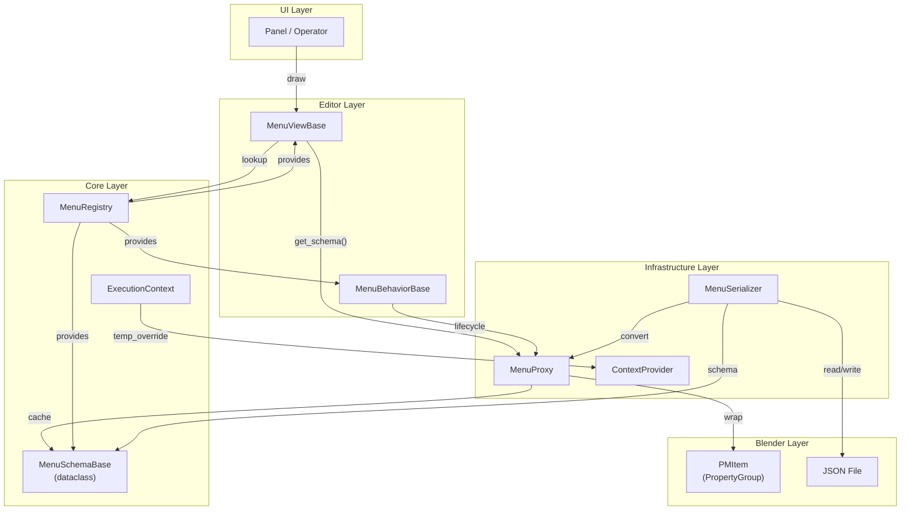
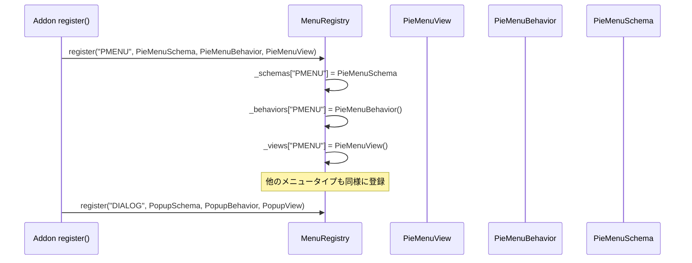
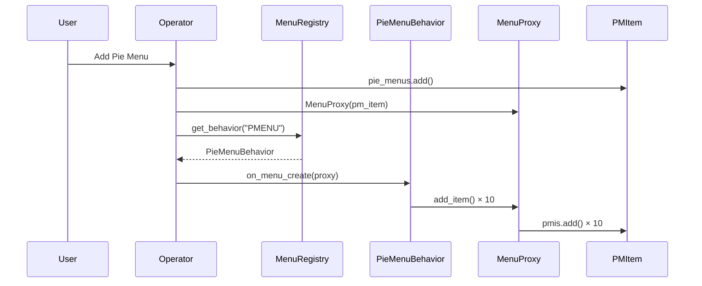
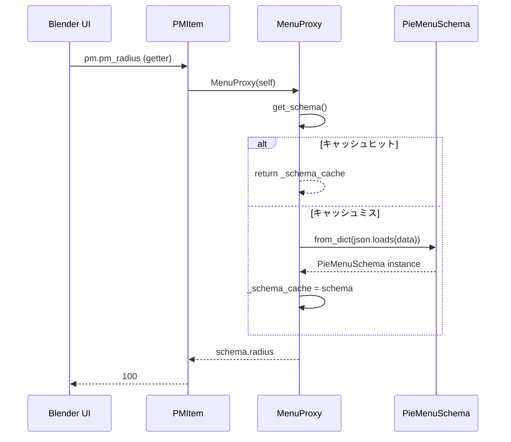

# PME2 理想アーキテクチャ

> Claude の考えた最強の PME アーキテクチャ

## 設計原則

1. **Core は Blender 非依存** — テスト可能、型安全
2. **PropertyGroup は薄いラッパー** — Blender シリアライズのためだけに存在
3. **Proxy パターン** — Core と Blender を疎結合に
4. **Registry パターン** — メニュータイプの拡張が容易
5. **temp_override ベース** — `_bpy` ハック排除
6. **dataclass ベースの Schema** — 型安全、IDE 補完対応
7. **Behavior と View の分離** — テスト容易性向上

---

## レイヤー構造

```
┌─────────────────────────────────────────────────────┐
│  UI Layer (Blender 依存)                            │
│  - Panels, Operators, Draw callbacks                │
├─────────────────────────────────────────────────────┤
│  Editor Layer (Blender 依存、ただし疎結合)          │
│  - MenuViewBase (UI 描画)                           │
│  - MenuBehaviorBase (振る舞い)                      │
├─────────────────────────────────────────────────────┤
│  Core Layer (Blender 非依存)                        │
│  - MenuSchemaBase (dataclass)                       │
│  - ExecutionContext (スクリプト実行)                │
│  - MenuRegistry (タイプ登録)                        │
├─────────────────────────────────────────────────────┤
│  Infrastructure Layer (Blender 依存)                │
│  - MenuProxy (PropertyGroup ラッパー)               │
│  - ContextProvider (temp_override ラッパー)         │
│  - Serializer (JSON I/O)                            │
└─────────────────────────────────────────────────────┘
```

---

## 全体クラス図

```mermaid
classDiagram
    direction TB

    %% ==================== Core Layer ====================
    namespace Core {
        class MenuSchemaBase {
            <<abstract>>
            <<dataclass>>
            +type_id()$ str
            +to_dict() dict
            +from_dict(data)$ Self
            +from_legacy(s)$ Self
        }

        class ItemSchemaBase {
            <<abstract>>
            <<dataclass>>
            +name: str
            +icon: str
            +enabled: bool
        }

        class ExecutionContext {
            -_globals: dict
            -_locals: dict
            +add_global(name, value)
            +execute(code) Result
            +evaluate(expr) Any
            +gen_globals() dict
        }

        class MenuRegistry {
            <<singleton>>
            -_schemas: dict
            -_behaviors: dict
            -_views: dict
            +register(type_id, schema, behavior, view)$
            +get_schema_class(type_id)$ type
            +get_behavior(type_id)$ MenuBehaviorBase
            +get_view(type_id)$ MenuViewBase
        }
    }

    %% ==================== Editor Layer ====================
    namespace Editor {
        class MenuBehaviorBase {
            <<abstract>>
            +fixed_num_items: bool
            +movable_items: bool
            +has_hotkey: bool
            +supported_item_modes: set
            +supported_open_modes: set
            +on_menu_create(menu)
            +on_menu_delete(menu)
            +on_item_add(menu, item)
            +on_item_remove(menu, item)
        }

        class MenuViewBase {
            <<abstract>>
            +schema_class: type
            +behavior_class: type
            +draw_settings(layout, menu)*
            +draw_items(layout, menu)*
            +draw_item(layout, menu, item, idx)
        }
    }

    %% ==================== Infrastructure Layer ====================
    namespace Infrastructure {
        class MenuProxy {
            -_pm: PMItem
            -_schema_cache: MenuSchemaBase
            +prop_group: PMItem
            +name: str
            +mode: str
            +items: list
            +get_schema() MenuSchemaBase
            +save_schema(schema)
            +add_item() ItemProxy
        }

        class ItemProxy {
            -_pmi: PMIItem
            -_schema_cache: ItemSchemaBase
            +get_schema() ItemSchemaBase
            +save_schema(schema)
        }

        class ContextProvider {
            -_saved: dict
            +save(context)
            +restore() contextmanager
            +get_area() Area?
            +get_region() Region?
        }

        class MenuSerializer {
            +SCHEMA_VERSION: str
            +export_menu(menu) dict
            +import_menu(data) MenuProxy
            +export_all() dict
            +import_all(data)
        }
    }

    %% ==================== Blender Layer ====================
    namespace Blender {
        class PMItem {
            <<PropertyGroup>>
            +name: StringProperty
            +mode: StringProperty
            +data: StringProperty
            +enabled: BoolProperty
            +pmis: CollectionProperty
            +pm_radius: IntProperty
            +pm_flick: BoolProperty
        }

        class PMIItem {
            <<PropertyGroup>>
            +name: StringProperty
            +mode: EnumProperty
            +text: StringProperty
            +icon: StringProperty
            +enabled: BoolProperty
        }
    }

    %% ==================== Concrete Implementations ====================
    namespace PieMenu {
        class PieMenuSchema {
            <<dataclass>>
            +radius: int = -1
            +flick: bool = True
            +confirm: int = -1
            +threshold: int = -1
            +type_id()$ "PMENU"
        }

        class PieMenuBehavior {
            +fixed_num_items = True
            +use_swap = True
            +on_menu_create(menu)
        }

        class PieMenuView {
            +draw_settings(layout, menu)
            +draw_items(layout, menu)
        }
    }

    namespace Popup {
        class PopupSchema {
            <<dataclass>>
            +title: bool = True
            +box: bool = False
            +width: int = 300
            +type_id()$ "DIALOG"
        }

        class PopupBehavior {
            +fixed_num_items = False
            +movable_items = True
        }

        class PopupView {
            +draw_settings(layout, menu)
            +draw_items(layout, menu)
        }
    }

    namespace Items {
        class CommandItemSchema {
            <<dataclass>>
            +command: str = ""
        }

        class PropertyItemSchema {
            <<dataclass>>
            +property_path: str = ""
            +expand: bool = False
        }

        class MenuItemSchema {
            <<dataclass>>
            +menu_name: str = ""
        }
    }

    %% ==================== Relationships ====================

    %% Core inheritance
    PieMenuSchema --|> MenuSchemaBase
    PopupSchema --|> MenuSchemaBase
    CommandItemSchema --|> ItemSchemaBase
    PropertyItemSchema --|> ItemSchemaBase
    MenuItemSchema --|> ItemSchemaBase

    %% Editor inheritance
    PieMenuBehavior --|> MenuBehaviorBase
    PopupBehavior --|> MenuBehaviorBase
    PieMenuView --|> MenuViewBase
    PopupView --|> MenuViewBase

    %% View associations
    PieMenuView ..> PieMenuSchema : schema_class
    PieMenuView ..> PieMenuBehavior : behavior_class
    PopupView ..> PopupSchema : schema_class
    PopupView ..> PopupBehavior : behavior_class

    %% Registry relationships
    MenuRegistry o-- MenuSchemaBase : manages
    MenuRegistry o-- MenuBehaviorBase : manages
    MenuRegistry o-- MenuViewBase : manages

    %% Proxy relationships
    MenuProxy --> PMItem : wraps
    MenuProxy --> MenuSchemaBase : caches
    MenuProxy "1" --> "*" ItemProxy : contains
    ItemProxy --> PMIItem : wraps
    ItemProxy --> ItemSchemaBase : caches

    %% PMItem relationships
    PMItem "1" --> "*" PMIItem : pmis

    %% Serializer relationships
    MenuSerializer ..> MenuProxy : serializes
    MenuSerializer ..> MenuSchemaBase : uses

    %% Execution context
    ExecutionContext ..> ContextProvider : uses
```



---

## データフロー



---

## 登録フロー



---

## メニュー作成フロー



---

## Schema アクセスフロー



---

## ディレクトリ構造

```
pie-menu-editor/
├── core/
│   ├── __init__.py
│   ├── execution.py         # ExecutionContext
│   ├── registry.py          # MenuRegistry
│   └── schemas/
│       ├── __init__.py
│       ├── base.py           # MenuSchemaBase, ItemSchemaBase
│       ├── pie_menu.py       # PieMenuSchema
│       ├── popup.py          # PopupSchema
│       ├── panel_group.py    # PanelGroupSchema
│       └── items/
│           ├── __init__.py
│           ├── command.py    # CommandItemSchema
│           ├── property.py   # PropertyItemSchema
│           └── menu.py       # MenuItemSchema
│
├── editors/
│   ├── __init__.py
│   ├── base/
│   │   ├── behavior.py       # MenuBehaviorBase
│   │   └── view.py           # MenuViewBase
│   ├── pie_menu/
│   │   ├── behavior.py       # PieMenuBehavior
│   │   └── view.py           # PieMenuView
│   ├── popup/
│   │   ├── behavior.py       # PopupBehavior
│   │   └── view.py           # PopupView
│   └── ...
│
├── infra/
│   ├── __init__.py
│   ├── proxy.py              # MenuProxy, ItemProxy
│   ├── context.py            # ContextProvider
│   └── serializer.py         # MenuSerializer
│
├── types.py                  # PMItem, PMIItem (薄いラッパー)
└── ...
```

---

## 現状との比較

| 観点 | 現状 | 理想 |
|-----|-----|------|
| **スキーマ** | 文字列 `"pm?pm_radius=100"` | dataclass `PieMenuSchema` |
| **型安全性** | なし | 完全 |
| **テスト** | Blender 必須 | Core は単体テスト可能 |
| **EditorBase** | 2000行の神クラス | Behavior + View に分離 |
| **BlContext** | `_bpy` ハック | `temp_override` ベース |
| **PropertyGroup** | ロジック混在 | 薄いラッパーのみ |
| **登録** | 暗黙的（`Editor()` 呼び出し） | 明示的 `MenuRegistry.register()` |
| **拡張性** | EditorBase 継承 | Registry に登録 |

---

## 移行戦略

```mermaid
flowchart LR
    subgraph Phase1["Phase 1: 並行運用"]
        A1["MenuSchemaBase 導入"]
        A2["MenuRegistry 導入"]
        A3["既存コードと共存"]
    end

    subgraph Phase2["Phase 2: Behavior 分離"]
        B1["MenuBehaviorBase 導入"]
        B2["EditorBase から抽出"]
        B3["ライフサイクルフック移動"]
    end

    subgraph Phase3["Phase 3: View 分離"]
        C1["MenuViewBase 導入"]
        C2["draw_* メソッド移動"]
        C3["EditorBase 廃止"]
    end

    subgraph Phase4["Phase 4: Infrastructure"]
        D1["MenuProxy 導入"]
        D2["ContextProvider 導入"]
        D3["BlContext 簡素化"]
    end

    subgraph Phase5["Phase 5: 整理"]
        E1["PMEProps 廃止"]
        E2["新 JSON 形式"]
        E3["_bpy 依存排除"]
    end

    Phase1 --> Phase2 --> Phase3 --> Phase4 --> Phase5
```



---

## 関連ドキュメント

- [CORE_LAYER_DESIGN_GUIDE.md](./CORE_LAYER_DESIGN_GUIDE.md) — 現状分析
- [EditorBase 分解計画](./editorbase-decomposition.md) — 分解の詳細
- [PMEProps スキーマシステム](./pmeprops-schema-system.md) — 現行システム
- [BlContext プロキシ](./blcontext-proxy.md) — コンテキスト管理
- [Editor と PMItem の関係](./editor-pmitem-relationship.md) — データと振る舞いの分離
