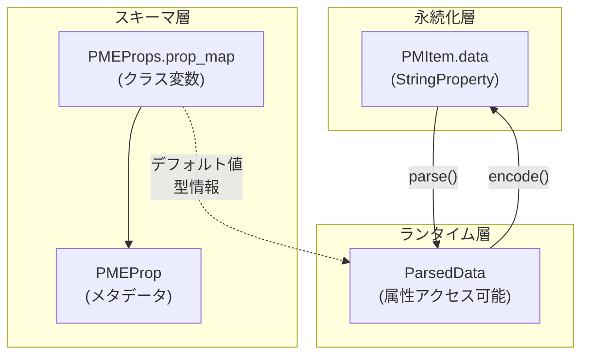
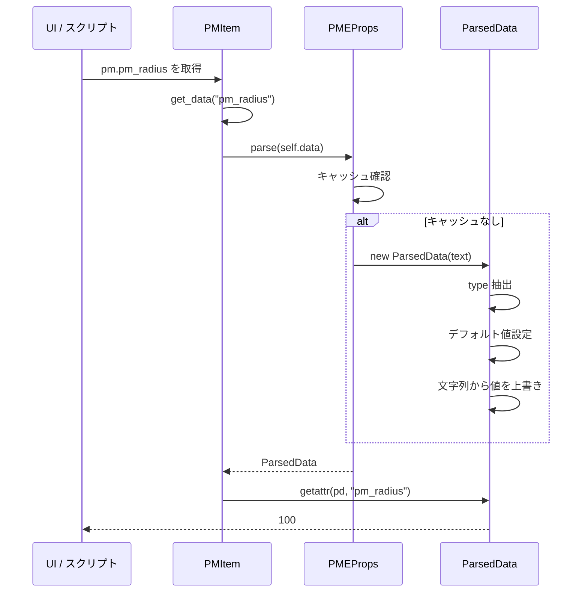
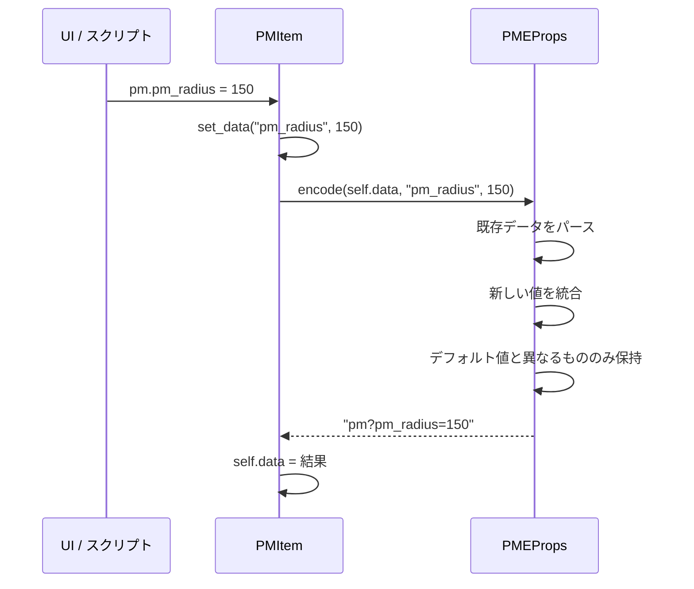
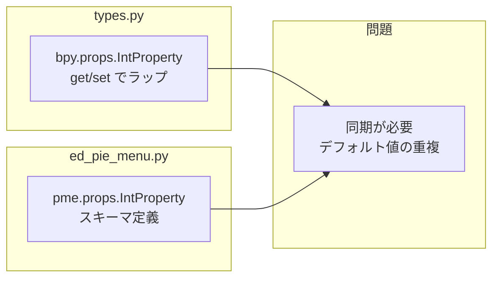
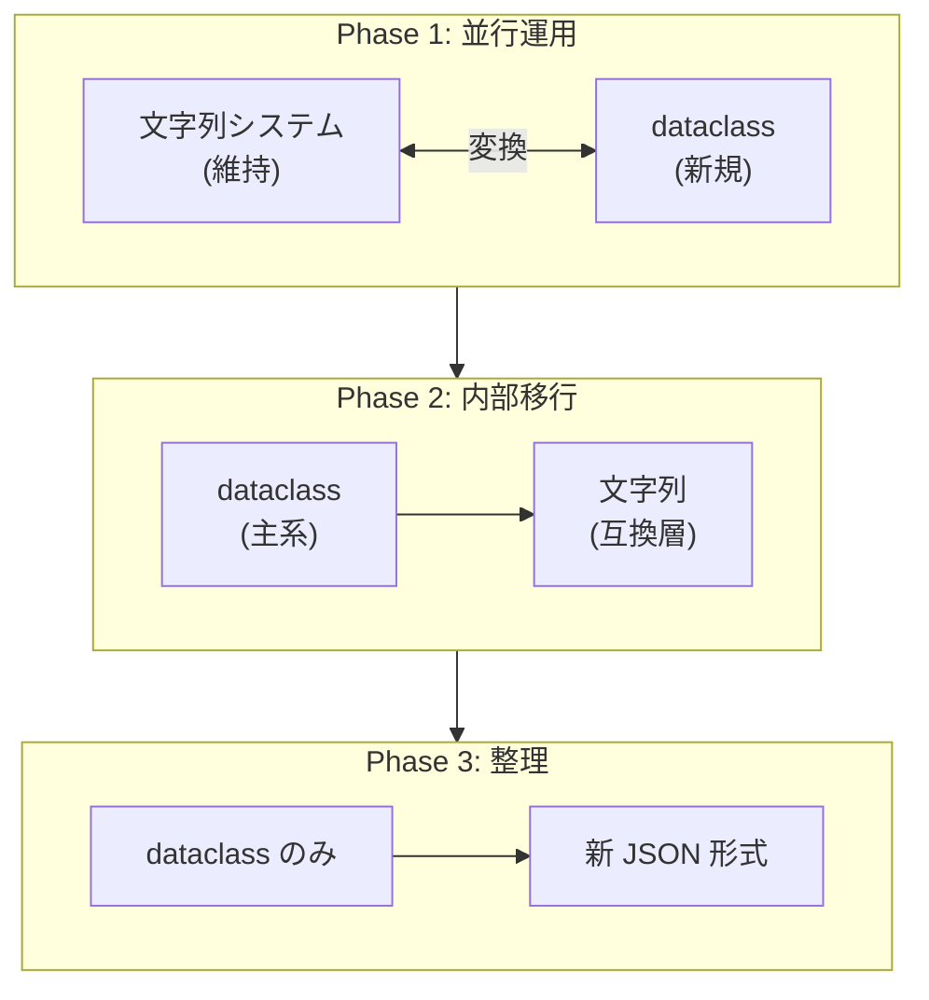

# PMEProps スキーマシステム

> PME Core Components Guide のサブページ

## 概要

`PMEProps` は PME 独自の**プロパティスキーマ管理システム**である。
Blender PropertyGroup の制約を回避し、異なるメニュータイプごとに柔軟な設定項目を持たせるために設計された。

---

## なぜ必要か？

### Blender PropertyGroup の制約

Blender の `PropertyGroup` は**静的**であり、クラス定義時に `bpy.props` で宣言した属性しか持てない。

しかし PME には複数のメニュータイプがあり、それぞれ異なる設定項目を持つ：

| メニュータイプ | 設定項目の例 |
|--------------|-------------|
| Pie Menu (`pm`) | `pm_radius`, `pm_flick`, `pm_confirm` |
| Popup Dialog (`pd`) | `pd_title`, `pd_box`, `pd_width` |
| Panel Group (`pg`) | `pg_context`, `pg_category`, `pg_space` |
| Modal (`mo`) | `confirm`, `block_ui`, `lock` |

全てを `PMItem` に直接定義すると膨大になり、使わない属性が大量に存在することになる。

---

## 解決策: data 文字列 + スキーマ管理

### アーキテクチャ



### データ文字列のフォーマット

```
"type?key1=value1&key2=value2"

例:
"pm?pm_radius=100&pm_flick=False"
 │   └──────────────┬────────────┘
 │                  │
 type (pm)          プロパティ（デフォルトと異なる値のみ）
```

**ポイント**: デフォルト値と同じ場合は保存されない（データ圧縮）

---

## データフロー

### 読み取り（get）



### 書き込み（set）



---

## スキーマ登録

### 登録方法

各エディタのモジュールレベルで呼び出される：

```python
# ed_pie_menu.py
pme.props.IntProperty("pm", "pm_radius", -1)
pme.props.IntProperty("pm", "pm_confirm", -1)
pme.props.BoolProperty("pm", "pm_flick", True)
```

引数：
1. `type`: メニュータイプ識別子（`pm`, `pd`, `pg` など）
2. `name`: プロパティ名
3. `default`: デフォルト値

### 登録箇所一覧

| ファイル | type | 登録されるプロパティ |
|---------|------|---------------------|
| `ed_pie_menu.py` | `pm` | `pm_radius`, `pm_confirm`, `pm_threshold`, `pm_flick` |
| `ed_popup.py` | `pd`, `row` | `pd_title`, `pd_box`, `pd_width`, `align`, `size` など |
| `ed_panel_group.py` | `pg` | `pg_context`, `pg_category`, `pg_space`, `pg_region` |
| `ed_modal.py` | `mo` | `confirm`, `block_ui`, `lock` |
| `ed_sticky_key.py` | `sk` | `sk_block_ui` |
| `ed_stack_key.py` | `s` | `s_undo`, `s_state` |
| `ed_property.py` | `prop` | `vector`, `mulsel`, `exp` |

---

## 二重定義の問題

現状、同じプロパティが2箇所で定義されている：

### (A) Blender PropertyGroup として

```python
# types.py
pm_radius: bpy.props.IntProperty(
    get=lambda s: s.get_data("pm_radius"),
    set=lambda s, v: s.set_data("pm_radius", v),
    default=-1,
)
```

### (B) PMEProps スキーマとして

```python
# ed_pie_menu.py
pme.props.IntProperty("pm", "pm_radius", -1)
```



---

## 設計上の課題

| 課題 | 詳細 |
|-----|------|
| **二重定義** | Blender PropertyGroup と PMEProps の両方で定義が必要 |
| **グローバル副作用** | モジュール読み込み時に `prop_map` が変更される |
| **初期化順序依存** | エディタモジュールの読み込み順序に依存 |
| **キャッシュの一貫性** | `parsed_data` キャッシュと `prop_map` 拡張の整合性 |

---

## 外部 API 設計への示唆

### この機能は「売り」になるか？

**結論: そのままでは売りにならない。しかし洗練すれば価値がある。**

#### 現状の問題

1. **内部実装の露出**: 文字列ベースのシリアライズは実装詳細
2. **型安全性の欠如**: 文字列パースは実行時エラーのリスク
3. **発見可能性が低い**: どのプロパティが使えるか分かりにくい

#### 価値のある部分

1. **動的なスキーマ拡張**: エディタごとに設定項目を追加可能
2. **デフォルト値の自動管理**: 保存サイズの最適化
3. **後方互換性**: 新しいプロパティ追加時に既存データが壊れない

#### API 化する場合の方向性

```python
# 理想的な外部 API（案）
@pme.schema("pm")
class PieMenuSchema:
    radius: int = -1
    flick: bool = True
    confirm: int = -1

# 使用側
pm = pme.get_menu("MyMenu")
pm.schema.radius = 100  # 型安全、補完が効く
```

---

## モダン化の検討: dataclass への移行

### 文字列システムは必須か？

**結論: 必須ではない。歴史的経緯で残っているだけ。**

現状の JSON エクスポートでは `pm.data` がそのまま保存されている：

```python
# preferences.py:3676-3686
base = [
    pm.name,
    pm.km_name,
    pm.to_hotkey(),
    items,
    pm.mode,
    pm.data,        # ← "pm?pm_radius=100" がそのまま入る
    ...
]
```

### 影響範囲

| 対象 | 箇所数 |
|-----|-------|
| `pm.data` / `pmi.data` 参照 | 28 |
| `parse()` 呼び出し | 69 |

**69箇所は大きいが、リファクタリング不可能ではない。**

### dataclass 化のリスクと対策

| リスク | 対策 |
|-------|------|
| **後方互換性** | 旧 JSON を読めるマイグレーション層が必要 |
| **Blender PropertyGroup との統合** | getter/setter は残す必要がある |
| **既存コードの大規模変更** | `pme.props.parse()` を呼んでる箇所が多数 |

### 推奨アプローチ: 段階的移行



### 実装イメージ

```python
from dataclasses import dataclass, field, asdict

@dataclass
class PieMenuSettings:
    """Pie Menu 固有の設定"""
    radius: int = -1
    flick: bool = True
    confirm: int = -1
    threshold: int = -1

    @classmethod
    def from_legacy_string(cls, s: str) -> "PieMenuSettings":
        """旧形式 "pm?pm_radius=100" からの変換"""
        pd = pme.props.parse(s)
        return cls(
            radius=pd.pm_radius,
            flick=pd.pm_flick,
            confirm=pd.pm_confirm,
            threshold=pd.pm_threshold,
        )

    def to_legacy_string(self) -> str:
        """旧形式への変換（後方互換用）"""
        parts = []
        if self.radius != -1:
            parts.append(f"pm_radius={self.radius}")
        if not self.flick:
            parts.append(f"pm_flick={self.flick}")
        # ...
        return "pm?" + "&".join(parts)

    def to_dict(self) -> dict:
        """新 JSON 形式用"""
        return asdict(self)
```

### JSON 形式の比較

```python
# 旧形式（現状）
{
    "menus": [
        ["MyMenu", "Window", "A", [...], "PMENU", "pm?pm_radius=100", ...]
    ]
}

# 新形式（提案）
{
    "schema": "PME-F2",
    "menus": [
        {
            "name": "MyMenu",
            "keymap": "Window",
            "hotkey": "A",
            "mode": "PMENU",
            "settings": {
                "radius": 100,
                "flick": true
            },
            "items": [...]
        }
    ]
}
```

### 結論

**モダン化してよい。むしろ今がタイミング。**

理由：
1. 文字列システムは技術的負債
2. 型安全でない、発見性が低い
3. 外部 API として公開しにくい
4. 後方互換はマイグレーション層で対応可能

---

## 関連ドキュメント

- [CORE_LAYER_DESIGN_GUIDE.md](./CORE_LAYER_DESIGN_GUIDE.md) - 全体概要
- PMEContext - 実行エンジン（予定）
- ParsedData - データパーサー（予定）
