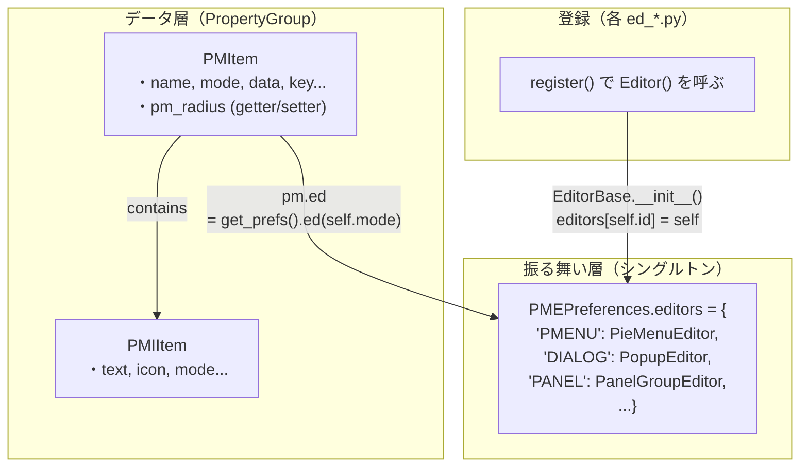
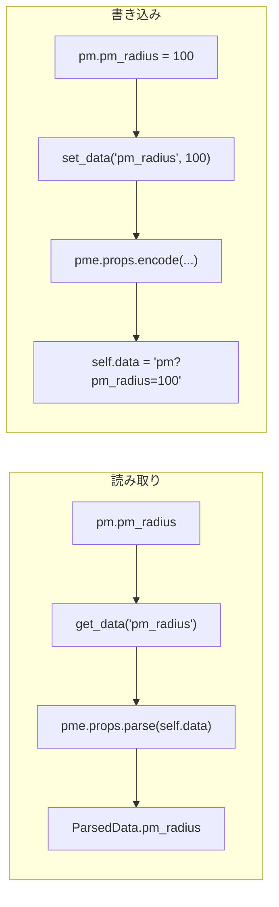
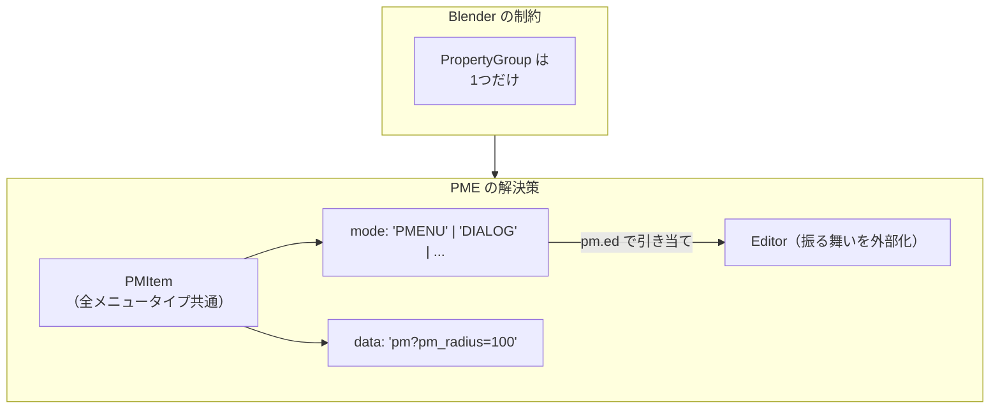

# Editor と PMItem の関係

> データと振る舞いの分離パターン

## 概要

PME では「データ」と「振る舞い」が分離されている：

- **PMItem**: データを保持する PropertyGroup（Blender 管理）
- **Editor**: 振る舞いを定義するシングルトン（PME 管理）

これは Blender PropertyGroup の制約に対する解決策である。

---

## アーキテクチャ



---

## 登録の仕組み

### EditorBase.__init__

```python
# ed_base.py:2068-2070
class EditorBase:
    def __init__(self):
        get_prefs().editors[self.id] = self  # ← 辞書に自己登録
```

### 各エディタの register()

```python
# ed_pie_menu.py:81-82
def register():
    Editor()  # ← インスタンス化するだけで登録される
```

### PMItem.ed プロパティ

```python
# types.py:881-882
@property
def ed(self):
    return get_prefs().ed(self.mode)  # ← mode で引き当て
```

---

## pm_radius のデータフロー（アダプターパターン）

`pm_radius` は `bpy.props.IntProperty` として定義されているが、実際のデータは `data` 文字列に保存される。

### 定義

```python
# types.py:579-584
pm_radius: bpy.props.IntProperty(
    subtype='PIXEL',
    description="Radius of the pie menu (-1 - use default value)",
    get=lambda s: s.get_data("pm_radius"),   # ← data から取得
    set=lambda s, v: s.set_data("pm_radius", v),  # ← data に書き込み
    default=-1,
)
```

### フロー



**これはアダプターパターン**：Blender PropertyGroup と PMEProps 文字列システムを繋いでいる。

---

## なぜ「継承」ではなく「委譲」なのか

### オブジェクト指向的な発想（やりたくなること）

```python
# こうしたくなる
class Menu(ABC):
    name: str
    hotkey: str

class PieMenu(Menu):
    radius: int = -1
    flick: bool = True

class PopupMenu(Menu):
    width: int = 300
    title: bool = True

# レジストリでクラスを管理
registry = {
    'PMENU': PieMenu,
    'DIALOG': PopupMenu,
}

# インスタンス化
my_menu = registry['PMENU'](name="MyMenu")
```

### Blender PropertyGroup の制約

```python
# Blender では...
class PMItem(bpy.types.PropertyGroup):
    # 1. クラス定義時に bpy.props で静的に宣言が必要
    # 2. PropertyGroup のサブクラスは作れない（Blender が管理）
    # 3. シリアライズは Blender が行う（.blend ファイル）
    pass

# ❌ これはできない
class PieMenuItem(PMItem):  # PropertyGroup のサブクラス化は不可
    pass
```

### PME の解決策



**継承ではなく委譲**：
- データ構造は1つ（PMItem）
- 振る舞いは mode で引き当てる（Editor）

---

## 設計の比較

| 観点 | 現状（委譲） | 継承ベース |
|-----|------------|----------|
| **Blender 互換** | ✅ PropertyGroup の制約に適合 | ❌ サブクラス化できない |
| **型安全性** | ❌ mode と data の整合性は実行時 | ✅ コンパイル時に検証可能 |
| **拡張性** | ✅ 新 Editor 追加は容易 | ✅ 新サブクラス追加も容易 |
| **データ移行** | ✅ mode を変えるだけ | ❌ 新インスタンス作成が必要 |
| **コード量** | ❌ アダプター層が必要 | ✅ 直接アクセス |

---

## 再設計案: Schema + Behavior + PropertyGroup

```python
# 1. Schema（型安全な設定定義）
@dataclass
class PieMenuSchema(MenuSchemaBase):
    radius: int = -1
    flick: bool = True
    confirm: int = -1

# 2. Behavior（振る舞い定義）
class PieMenuBehavior(MenuBehaviorBase):
    fixed_num_items = True
    supported_open_modes = {'PRESS', 'HOLD'}

# 3. Registry（スキーマとビヘイビアの登録）
SCHEMA_REGISTRY = {
    'PMENU': PieMenuSchema,
    'DIALOG': PopupSchema,
}

BEHAVIOR_REGISTRY = {
    'PMENU': PieMenuBehavior,
    'DIALOG': PopupBehavior,
}

# 4. PMItem（薄いラッパー）
class PMItem(bpy.types.PropertyGroup):
    mode: bpy.props.StringProperty()
    data: bpy.props.StringProperty()  # JSON

    def get_schema(self) -> MenuSchemaBase:
        schema_cls = SCHEMA_REGISTRY[self.mode]
        return schema_cls.from_dict(json.loads(self.data))

    def get_behavior(self) -> MenuBehaviorBase:
        return BEHAVIOR_REGISTRY[self.mode]

    # 便利プロパティ
    @property
    def radius(self) -> int:
        return self.get_schema().radius
```

### メリット

1. **Schema は純粋な dataclass** → 型安全、テスト可能
2. **Behavior は振る舞いのみ** → 責務が明確
3. **PMItem は Blender との橋渡し役だけ** → 薄く保てる
4. **Registry でメニュータイプを管理** → 拡張しやすい

---

## 関連ドキュメント

- [CORE_LAYER_DESIGN_GUIDE.md](./CORE_LAYER_DESIGN_GUIDE.md) - 全体概要
- [PMEProps スキーマシステム](./pmeprops-schema-system.md) - 現行の文字列システム
- [EditorBase 分解計画](./editorbase-decomposition.md) - Schema/Behavior/View 分離
