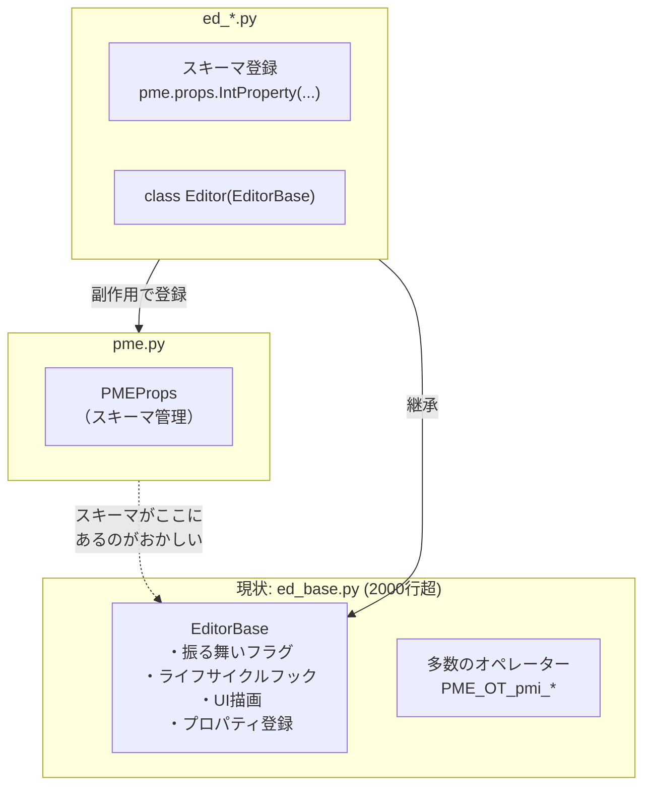
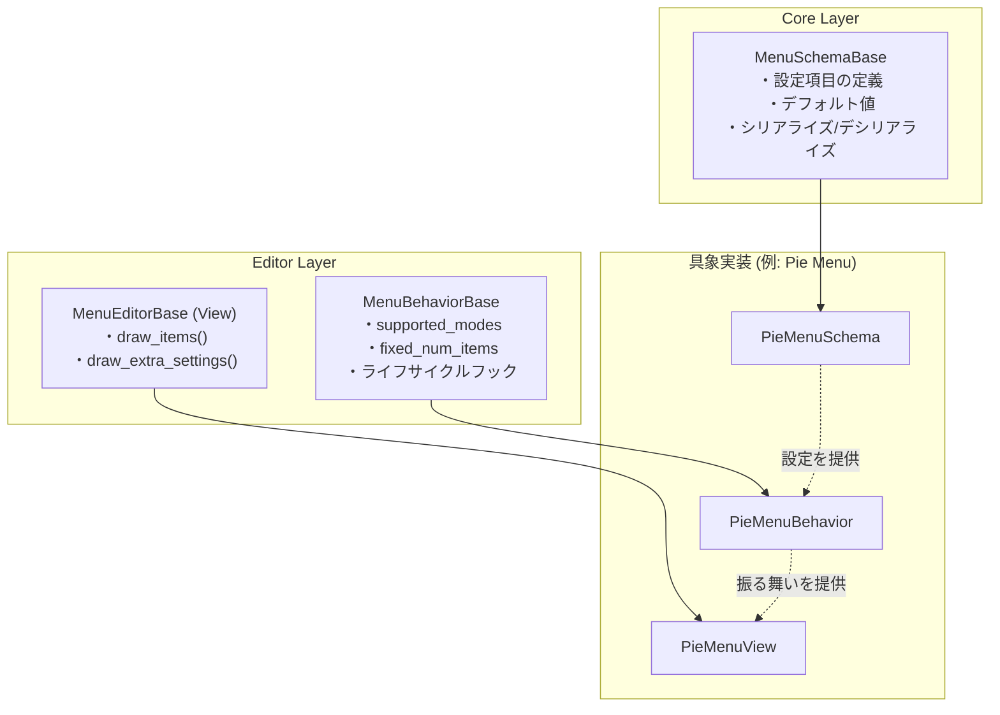
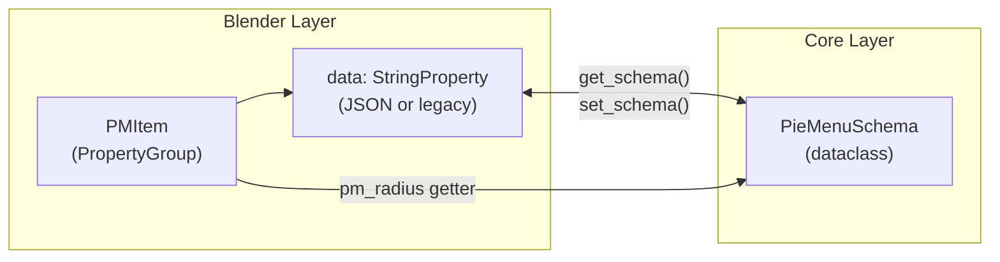
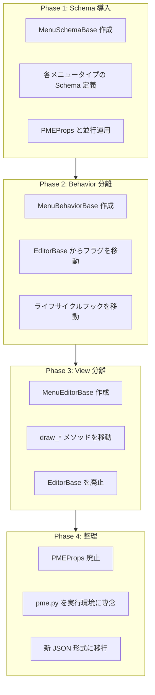

# EditorBase 分解計画

> PME2 Core Layer 再設計の中心的提案

## 背景

### 現状の問題

`ed_base.py` の `EditorBase` は 2000行超の「なんでも屋」になっている：

- スキーマ管理（PMEProps との暗黙の結合）
- 振る舞い定義（フラグ群）
- ライフサイクルフック
- UI 描画
- オペレーター定義



### pme.py の本来の役割

`pme.py` は**実行環境**としての役割に専念すべき：

```python
# pme.py が持つべきもの
class PMEContext:
    """ユーザースクリプトの実行環境"""
    def exe(self, code, globals=None): ...
    def eval(self, expression, globals=None): ...
    def gen_globals(self): ...

# pme.py が持つべきでないもの
class PMEProps:      # ← スキーマ管理は Editor 側へ
class ParsedData:    # ← スキーマ管理は Editor 側へ
```

---

## 提案: EditorBase を3層に分解



---

## 各層の責務

### 1. MenuSchemaBase（Core Layer）

**設定スキーマの定義**。Blender 非依存を目指す。

```python
# core/schemas/base.py
from dataclasses import dataclass, asdict
from abc import ABC, abstractmethod
from typing import TypeVar, Type

T = TypeVar('T', bound='MenuSchemaBase')

@dataclass
class MenuSchemaBase(ABC):
    """メニュー設定のスキーマ基底クラス"""

    @classmethod
    @abstractmethod
    def type_id(cls) -> str:
        """識別子: 'pm', 'pd', 'pg' など"""
        ...

    def to_dict(self) -> dict:
        """JSON シリアライズ用"""
        return asdict(self)

    @classmethod
    def from_dict(cls: Type[T], data: dict) -> T:
        """JSON デシリアライズ"""
        return cls(**data)

    # 後方互換
    @classmethod
    def from_legacy_string(cls: Type[T], s: str) -> T:
        """旧 "pm?pm_radius=100" 形式からの変換"""
        ...

    def to_legacy_string(self) -> str:
        """旧形式への変換（後方互換用）"""
        ...
```

**具象実装例**:

```python
# core/schemas/pie_menu.py
@dataclass
class PieMenuSchema(MenuSchemaBase):
    radius: int = -1
    flick: bool = True
    confirm: int = -1
    threshold: int = -1

    @classmethod
    def type_id(cls) -> str:
        return "pm"
```

### 2. MenuBehaviorBase（Editor Layer）

**振る舞いの定義**。ライフサイクルフックを含む。

```python
# editors/base/behavior.py
from abc import ABC

class MenuBehaviorBase(ABC):
    """メニューの振る舞い定義"""

    # 振る舞いフラグ
    fixed_num_items: bool = False
    movable_items: bool = True
    use_swap: bool = False
    has_hotkey: bool = True
    editable_slots: bool = True
    toggleable_slots: bool = True

    # サポートするモード
    supported_slot_modes: set = {'EMPTY', 'COMMAND', 'PROP', 'MENU', 'HOTKEY', 'CUSTOM'}
    supported_open_modes: set = {'PRESS', 'HOLD', 'DOUBLE_CLICK', 'ONE_SHOT'}
    supported_sub_menus: set = {'PMENU', 'RMENU', 'DIALOG', 'SCRIPT'}

    # ライフサイクルフック
    def on_pm_add(self, pm): pass
    def on_pm_remove(self, pm): pass
    def on_pm_rename(self, pm, name): pass
    def on_pm_enabled(self, pm, value): pass

    def on_pmi_add(self, pm, pmi): pass
    def on_pmi_remove(self, pm): pass
    def on_pmi_rename(self, pm, pmi, old_name, name): pass
```

**具象実装例**:

```python
# editors/pie_menu/behavior.py
class PieMenuBehavior(MenuBehaviorBase):
    fixed_num_items = True
    use_swap = True
    supported_open_modes = {'PRESS', 'HOLD', 'DOUBLE_CLICK'}

    def on_pm_add(self, pm):
        # Pie Menu は 10 スロット固定
        for i in range(10):
            pm.pmis.add()
```

### 3. MenuEditorBase / View（Editor Layer）

**UI 描画**。Blender 依存。

```python
# editors/base/view.py
from abc import ABC, abstractmethod

class MenuEditorBase(ABC):
    """メニューエディタの UI 描画"""

    schema_class: type  # MenuSchemaBase のサブクラス
    behavior: MenuBehaviorBase

    @abstractmethod
    def draw_items(self, layout, pm): ...

    @abstractmethod
    def draw_extra_settings(self, layout, pm): ...

    def draw_pmi_menu_btn(self, pr, idx): ...
```

**具象実装例**:

```python
# editors/pie_menu/view.py
class PieMenuView(MenuEditorBase):
    schema_class = PieMenuSchema
    behavior = PieMenuBehavior()

    def draw_extra_settings(self, layout, pm):
        schema = pm.get_schema()  # PieMenuSchema インスタンス
        layout.prop(pm, "radius")
        layout.prop(pm, "flick")
        if schema.flick:
            layout.prop(pm, "threshold")
            layout.prop(pm, "confirm")

    def draw_items(self, layout, pm):
        for idx, pmi in enumerate(pm.pmis):
            self.draw_item(pm, pmi, idx)
```

---

## Blender PropertyGroup との統合

### 制約

Blender の `PropertyGroup` には以下の制約がある：

1. **静的定義**: クラス定義時に `bpy.props` で宣言が必要
2. **シリアライズ**: `.blend` ファイルへの保存は Blender が行う
3. **動的追加の困難さ**: 実行時のプロパティ追加は可能だが推奨されない

### 解決策: Adapter パターン

**PropertyGroup は維持しつつ、Schema をアダプターとして使う**:

```python
# types.py (PMItem)
class PMItem(bpy.types.PropertyGroup):
    # Blender PropertyGroup のプロパティ（永続化用）
    data: bpy.props.StringProperty()  # 旧形式互換 or JSON

    # Schema へのアクセサ
    _schema_cache: dict = {}  # クラス変数でキャッシュ

    def get_schema(self) -> MenuSchemaBase:
        """Schema インスタンスを取得"""
        if self.name not in self._schema_cache:
            schema_cls = get_schema_class(self.mode)  # PMENU → PieMenuSchema
            if self.data.startswith("{"):
                # 新形式 (JSON)
                self._schema_cache[self.name] = schema_cls.from_dict(json.loads(self.data))
            else:
                # 旧形式 (pm?pm_radius=100)
                self._schema_cache[self.name] = schema_cls.from_legacy_string(self.data)
        return self._schema_cache[self.name]

    def set_schema(self, schema: MenuSchemaBase):
        """Schema を保存"""
        self._schema_cache[self.name] = schema
        self.data = json.dumps(schema.to_dict())

    # 便利プロパティ（Blender UI から直接アクセス用）
    pm_radius: bpy.props.IntProperty(
        get=lambda s: s.get_schema().radius,
        set=lambda s, v: s._update_schema("radius", v),
    )
```



### PropertyGroup 制約はクリアできるか？

**結論: 完全にはクリアできないが、十分に隠蔽できる。**

| 制約 | 対処 |
|-----|------|
| 静的定義 | getter/setter でラップし、内部は動的に |
| シリアライズ | `data` 文字列に JSON を保存 |
| 動的追加 | Schema 側で対応、PropertyGroup は薄いラッパー |

**重要**: PropertyGroup を完全に廃止することは**できない**（Blender のシリアライズに依存）。
しかし、ビジネスロジックからは隠蔽できる。

---

## 移行計画



---

## ディレクトリ構造（案）

```
pie-menu-editor/
├── core/
│   ├── __init__.py
│   ├── context.py          # PMEContext（実行環境）
│   └── schemas/
│       ├── __init__.py
│       ├── base.py          # MenuSchemaBase
│       ├── pie_menu.py      # PieMenuSchema
│       ├── popup.py         # PopupSchema
│       ├── panel_group.py   # PanelGroupSchema
│       └── ...
│
├── editors/
│   ├── __init__.py
│   ├── base/
│   │   ├── behavior.py      # MenuBehaviorBase
│   │   └── view.py          # MenuEditorBase
│   ├── pie_menu/
│   │   ├── behavior.py      # PieMenuBehavior
│   │   └── view.py          # PieMenuView
│   ├── popup/
│   │   ├── behavior.py
│   │   └── view.py
│   └── ...
│
├── types.py                 # PMItem, PMIItem（PropertyGroup、薄いラッパー）
├── pme.py                   # PMEContext のみ（スリム化）
└── ...
```

---

## 期待される効果

| 観点 | 現状 | 改善後 |
|-----|-----|-------|
| **責務分離** | EditorBase に全部入り | Schema / Behavior / View に分離 |
| **テスト容易性** | Blender 依存で困難 | Schema / Behavior は単体テスト可能 |
| **型安全性** | 文字列ベース | dataclass で型ヒント完備 |
| **発見可能性** | pme.props.parse() を知らないと使えない | Schema クラスを見れば分かる |
| **外部 API** | 内部実装露出 | Schema を公開 API として整備可能 |

---

## 関連ドキュメント

- [CORE_LAYER_DESIGN_GUIDE.md](./CORE_LAYER_DESIGN_GUIDE.md) - 全体概要
- [PMEProps スキーマシステム](./pmeprops-schema-system.md) - 現行システムの詳細
