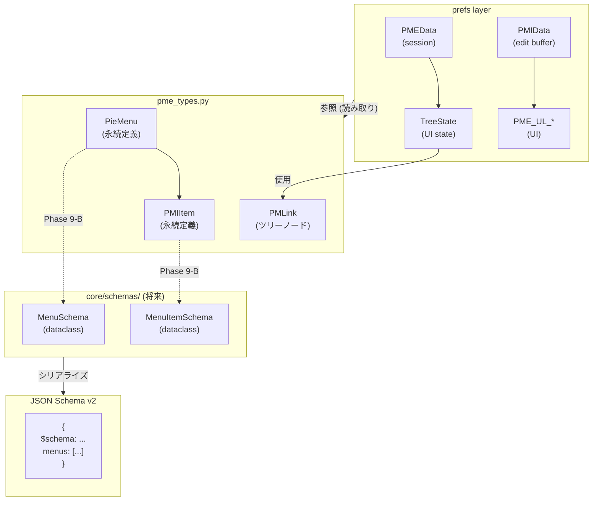
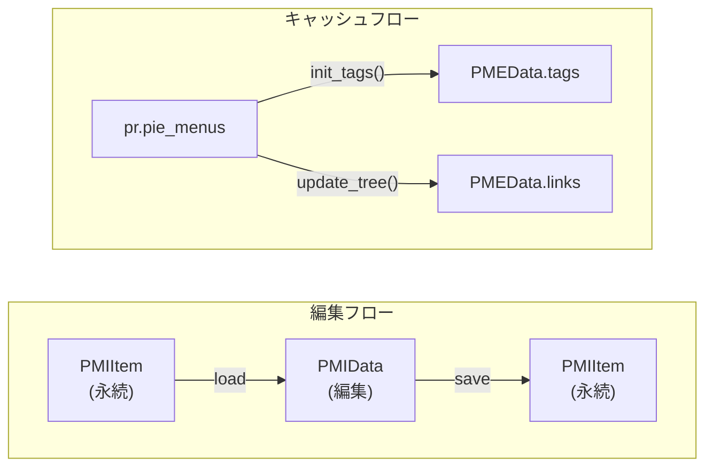

# prefs/ データ構造の責務分析

> Version: 1.0.0
> Status: Analysis Complete
> Last Updated: 2026-01-06
> Related: preferences.py split (P1-P8), JSON Schema v2

---

## 概要

preferences.py の分割（P1-P8）完了後、`PMEData`, `PMIData`, `TreeState` の責務を分析し、
PME2 / JSON Schema v2 との関係を明確化した文書。

### 結論

| クラス | 役割 | JSON Schema v2 との関係 |
|--------|------|------------------------|
| `PMEData` | セッションコンテナ | **対象外** - 編集セッションの一時データ |
| `PMIData` | 編集バッファ | **対象外** - 選択中アイテムの編集フォーム |
| `TreeState` | UI 状態 | **対象外** - ツリー表示の展開/折りたたみ |

**重要**: JSON Schema v2 の対象は `PieMenu`/`PMIItem` (pme_types.py) であり、
上記 3 クラスは「消費者」として prefs レイヤに正当に属する。

---

## データ分類の定義

| 分類 | 説明 | JSON エクスポート |
|------|------|------------------|
| **永続定義 (Persistent Definition)** | メニュー構造、アイテム、ホットキー | ✅ 対象 |
| **派生キャッシュ (Derived Cache)** | 永続定義から算出される一時データ | ❌ 対象外 |
| **セッション状態 (Session State)** | 編集中の一時データ、エフェメラル | ❌ 対象外 |
| **UI 状態 (UI State)** | 表示のみに影響、永続化は任意 | ❌ 対象外 |

---

## PMEData (prefs/temp_data.py)

### 役割

`temp_prefs()` で取得されるセッションコンテナ。
モーダル編集状態、タグキャッシュ、ツリーリンクなどを保持。

### フィールド分類

| フィールド | 分類 | 説明 |
|-----------|------|------|
| `update_lock` | ランタイム | 再帰更新防止フラグ |
| `prop_data` | セッション | プロパティ解析用ヘルパー |
| `ed_props` | セッション | エディタプロパティポインター |
| `tags` | **派生キャッシュ** | `pie_menus` から `init_tags()` で算出 |
| `links` | **UI 状態** | ツリー表示用リンク (PMLink の Collection) |
| `links_idx` | **UI 状態** | ツリーの現在選択位置 |
| `hidden_panels_idx` | **UI 状態** | 非表示パネルリストの選択位置 |
| `pie_menus` | **派生キャッシュ** | サブメニュー候補リスト |
| `modal_item_hk` | **セッション** | モーダルオペレーター編集中のホットキー |
| `modal_item_prop_*` | **セッション** | モーダルプロパティ編集中の範囲/ステップ |
| `modal_item_custom` | **セッション** | モーダルカスタム値 |
| `settings_tab` | **UI 状態** | 設定タブの選択 |
| `icons_tab` | **UI 状態** | アイコンタブの選択 |

### JSON Schema v2 との関係

```
PMEData.tags  ──派生──>  PieMenu.tag  ──エクスポート──>  Menu.tags[]
                        (pme_types.py)                   (json_schema_v2.md)
```

- `PMEData.tags` は JSON エクスポートの対象外
- エクスポート時は各 `PieMenu.tag` から直接抽出

### 将来の方向性

- **移動不要**: prefs レイヤに正当に属する
- **改善候補**: `modal_item_*` 系を `ModalEditingState` クラスに集約（可読性向上のみ）

---

## PMIData (prefs/pmi_data.py)

### 役割

`pr.pmi_data` で取得される編集バッファ。
選択中のメニューアイテムを編集するための「フォーム」データ。

### パターン: View Model / Edit Buffer

```
[PMIItem]  ────load────>  [PMIData]  ────save────>  [PMIItem]
(永続定義)               (編集バッファ)            (永続定義)
```

ユーザーが PMI を選択すると、その値が PMIData にロードされ、
UI で編集後、保存時に PMIItem に書き戻される。

### フィールド分類

| フィールド | 分類 | 説明 |
|-----------|------|------|
| `_kmi` | ランタイム | オペレーター引数編集用 KMI |
| `errors`, `infos` | エフェメラル | バリデーション結果 |
| `mode` | **編集バッファ** | アイテムタイプ (COMMAND, MENU, etc.) |
| `cmd` | **編集バッファ** | Python コード |
| `custom` | **編集バッファ** | カスタムレイアウトコード |
| `prop` | **編集バッファ** | プロパティパス |
| `menu` | **編集バッファ** | サブメニュー名 |
| `icon` | **編集バッファ** | アイコン名 |
| `name` | **編集バッファ** | 表示名 |
| `sname` | **編集バッファ** | 提案名 (自動生成) |
| `key`, `ctrl`, `shift`, `alt`, `oskey`, `key_mod`, `any` | **編集バッファ** | ホットキー編集 |
| `expand_menu`, `use_cb`, `use_frame` | **編集バッファ** | 表示オプション |
| `cmd_ctx`, `cmd_undo` | **編集バッファ** | オペレーター実行コンテキスト |

### JSON Schema v2 との関係

```
PMIData  ──対応──>  PMIItem  ──変換──>  MenuItem + Action
                   (pme_types.py)      (json_schema_v2.md)
```

- PMIData は JSON エクスポートの対象外
- エクスポート時は PMIItem の値を直接変換

### 将来の方向性

- **移動不要**: 編集 UI のバッファとして prefs レイヤに正当に属する
- **検討事項**: Phase 9-B で `core/schemas/MenuItemSchema` を実装する際、
  PMIData ↔ MenuItemSchema の変換ヘルパーが必要になる可能性

---

## TreeState (prefs/tree.py)

### 役割

ツリービューの UI 状態を管理するシングルトン。
UIList のライフサイクルから独立して展開/折りたたみ状態を保持。

### フィールド分類

| フィールド | 分類 | 永続化 | 説明 |
|-----------|------|--------|------|
| `locked` | ランタイム | ❌ | 更新中フラグ |
| `groups` | **派生** | ❌ | group_by 設定から算出 |
| `collapsed_groups` | **UI 状態** | ✅ tree.json | 折りたたまれたグループ |
| `expanded_folders` | **UI 状態** | ✅ tree.json | 展開されたフォルダ |
| `has_folders` | **派生** | ❌ | フォルダ有無フラグ |

### 永続化: tree.json

```json
{
  "group_by": "KEYMAP",
  "groups": ["Window", "3D View"],
  "folders": ["Window/My Pie Menu"]
}
```

**注意**: これは JSON Schema v2 とは別の永続化。
tree.json は「UI 設定」であり、メニュー定義のエクスポートには含まれない。

### JSON Schema v2 との関係

```
TreeState  ──────────────────────────────────>  対象外
                                               (UI 状態のみ)

PieMenu    ──────────────────────────────────>  Menu
(pme_types.py)                                 (json_schema_v2.md)
```

### 将来の方向性

- **移動不要**: UI 状態として prefs レイヤに正当に属する
- **Phase P1-P8 で完了**: TreeState は既に PME_UL_pm_tree から分離済み
- **改善なし**: 現状で十分クリーン

---

## 永続定義の所在地

JSON Schema v2 の対象となる「永続定義」は以下に存在:

| 現在の場所 | 将来の場所 | JSON Schema v2 |
|-----------|-----------|----------------|
| `PieMenu` (pme_types.py) | `core/schemas/MenuSchema` | Menu オブジェクト |
| `PMIItem` (pme_types.py) | `core/schemas/MenuItemSchema` | MenuItem オブジェクト |
| Hotkey encode/decode (keymap_helper.py) | `core/schemas/HotkeySchema` | Hotkey オブジェクト |
| Settings parse (PMEProp/ParsedData) | `core/schemas/SettingsSchema` | settings オブジェクト |

**Phase 9-B** で `core/schemas/` ディレクトリを作成し、
dataclass ベースのスキーマを実装する予定。

---

## 依存関係図



### データフローの詳細



---

## 参照

- `@_docs/design/json_schema_v2.md` — JSON 形式仕様
- `@.claude/rules/milestones.md` — Phase 9 の計画
- `@prefs/temp_data.py` — PMEData 実装
- `@prefs/pmi_data.py` — PMIData 実装
- `@prefs/tree.py` — TreeState 実装

---

*Last Updated: 2026-01-06*
*Analysis completed after preferences.py split (P1-P8)*
