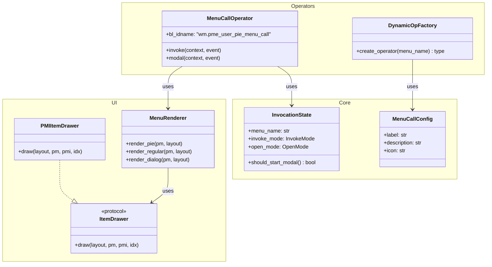

# WM_OT_pme_user_pie_menu_call 詳細分析

> Version: Draft 1.0
> Status: Analysis Phase
> Created: 2026-01-04

---

## 目次

1. [現状分析](#現状分析)
2. [責務の整理](#責務の整理)
3. [問題点](#問題点)
4. [理想的なユーザー体験](#理想的なユーザー体験)
5. [理想設計](#理想設計)
6. [移行戦略](#移行戦略)
7. [参照](#参照)

---

## 現状分析

### 基本情報

| 項目 | 値 |
|------|-----|
| ファイル | `operators/__init__.py:1136` |
| bl_idname | `wm.pme_user_pie_menu_call` |
| bl_label | `"Call Menu (PME)"` |
| bl_description | `"Call PME menu"` |
| bl_options | `{'INTERNAL'}` |

### クラス属性

```python
class WM_OT_pme_user_pie_menu_call(Operator):
    # クラス変数（静的状態管理）
    hold_inst = None           # HOLD モード用のインスタンス参照
    active_ops = {}            # アクティブなオペレーターの辞書 {pie_menu_name: instance}
    pressed_key = None         # 押下中のキー

    # プロパティ
    pie_menu_name: StringProperty(options={'SKIP_SAVE'})
    invoke_mode: StringProperty(options={'SKIP_SAVE'})
    keymap: StringProperty(options={'HIDDEN', 'SKIP_SAVE'})
    slot: IntProperty(default=-1, options={'SKIP_SAVE'})
```

### invoke_mode の種類

| invoke_mode | 用途 | トリガー |
|-------------|------|---------|
| `'HOTKEY'` | キーマップからの直接呼び出し | ユーザーのホットキー |
| `'RELEASE'` | キーリリース時に表示 | HOLD/PRESS モード後 |
| `'HOLD'` | ホールド後に表示 | HOLD タイマー完了 |
| `'TWEAK'` | ドラッグ開始時に表示 | マウス移動閾値超過 |
| `'SUB'` | サブパイメニュー | 親パイメニューから |
| `'CHORDS'` | コード（複数キー）タイムアウト後 | コードタイマー完了 |

### open_mode（メニュー設定側）

| open_mode | 説明 |
|-----------|------|
| `'PRESS'` | 即座に表示 |
| `'HOLD'` | ホールド後に表示 |
| `'CLICK'` | クリック（押して離す）で表示 |
| `'TWEAK'` / `'CLICK_DRAG'` | ドラッグ開始で表示 |
| `'CHORDS'` | コードシーケンス |

---

## 責務の整理

現在の `WM_OT_pme_user_pie_menu_call` は **6 つ以上の責務** を担っている：

### 1. ステートマシン管理 (invoke/modal)

```
┌─────────┐    HOTKEY     ┌──────────────┐
│  Idle   │──────────────>│  parse_mode  │
└─────────┘               └──────┬───────┘
                                 │
            ┌────────────────────┼────────────────────┐
            │                    │                    │
            v                    v                    v
    ┌───────────────┐    ┌───────────────┐    ┌───────────────┐
    │  Hold Timer   │    │  Tweak Wait   │    │  Chord Wait   │
    │  modal_start  │    │  modal_start  │    │  modal_start  │
    └───────┬───────┘    └───────┬───────┘    └───────┬───────┘
            │                    │                    │
     TIMER timeout        MOUSEMOVE           TIMER/KEY
            │                    │                    │
            v                    v                    v
    ┌───────────────┐    ┌───────────────┐    ┌───────────────┐
    │ execute_menu  │    │ execute_menu  │    │ execute_menu  │
    │   (HOLD)      │    │   (TWEAK)     │    │   (matched)   │
    └───────────────┘    └───────────────┘    └───────────────┘
```

**問題**: 複雑なステートマシンが 1 クラスに凝縮されており、テスト困難。

### 2. UI 描画 (`_draw_item`)

```python
@staticmethod
def _draw_item(pr, pm, pmi, idx):
    """アイテムを UI に描画（約 200 行）"""
    # pmi.mode による分岐:
    # - COMMAND: オペレーター呼び出し or カスタムコマンド実行
    # - MENU: サブメニュー展開/呼び出し
    # - PROP: プロパティ表示
    # - HOTKEY: ホットキー実行ボタン
    # - CUSTOM: カスタムスクリプト実行
```

**問題**: `_draw_item` は UI 描画ロジックであり、オペレーターの責務ではない。

### 3. 描画コールバック生成

```python
def _draw_pm(self, menu, context):    # Pie Menu 描画
def _draw_rm(self, menu, context):    # Regular Menu 描画
def _draw_popup_dialog(self, menu, context):  # Popup Dialog 描画
def _draw_slot(name, use_frame=None):  # Slot 描画（静的）
```

### 4. メニュー呼び出し (execute_menu)

```python
def execute_menu(self, context, event):
    # pm.mode による分岐:
    # - PMENU: wm.popup_menu_pie()
    # - RMENU: wm.popup_menu()
    # - DIALOG: wm.pme_user_dialog_call() or popup_dialog_pie()
    # - SCRIPT: StackKey.next()
    # - STICKY: pme.sticky_key()
    # - MACRO: execute_macro()
    # - MODAL: pme.modal() or pme.modal_grab()
```

### 5. Blender 設定の一時変更

```python
# execute_menu 内
pr.pie_menu_radius.save()
view.pie_animation_timeout = 0
view.pie_menu_radius = radius
# ... 後で restore
```

### 6. 複数メニューの競合解決

```python
# invoke 内
for pm in pr.pie_menus:
    if (同じキー組み合わせで異なる open_mode):
        self._parse_open_mode(pm)  # HOLD/PRESS/TWEAK の組み合わせ
```

---

## 問題点

### 1. 単一責任原則の違反

1 つのクラスに 6 以上の責務が混在。

### 2. レイヤー違反の原因

`_draw_item` がオペレータークラスにあるため、他モジュールからの参照がレイヤー違反を引き起こす：

| 参照元 | レイヤー | 違反 |
|--------|---------|------|
| `ui/utils.py:52` | ui | ui → operators |
| `editors/panel_group.py:177` | editors | editors → operators |
| `pme_types.py:36` | infra | infra → operators |

### 3. bl_label/bl_description の固定

```python
bl_label = "Call Menu (PME)"
bl_description = "Call PME menu"
```

**問題**:
- ユーザーには「何を呼び出しているか」が不明
- キーマップ一覧で識別困難
- スクリーンリーダー対応が困難

### 4. 巨大な invoke/modal メソッド

- `invoke`: 約 200 行
- `modal`: 約 200 行
- 条件分岐のネストが深い
- テスト困難

### 5. クラス変数による状態管理

```python
hold_inst = None
active_ops = {}
pressed_key = None
```

**問題**: 複数ウィンドウでの動作が予測困難。

---

## 理想的なユーザー体験

### 1. 動的 bl_label / bl_description

```python
# 理想: ユーザーが見るラベルがカスタマイズ可能
bl_label = "My Modeling Pie"  # メニュー名を反映
bl_description = "Open pie menu for modeling operations"  # ユーザー定義の説明
```

**メリット**:
- キーマップ一覧でメニューを識別可能
- ツールチップで用途がわかる
- スクリーンリーダー対応

### 2. 動的オペレーター生成

```python
# 各メニューごとに専用オペレーターを生成
class PME_OT_call_My_Modeling_Pie(Operator):
    bl_idname = "pme.call_my_modeling_pie"
    bl_label = "My Modeling Pie"
    bl_description = "Open pie menu for modeling operations"

    def invoke(self, context, event):
        return pme.invoke_pm("My Modeling Pie", event)
```

**参照**: json_schema_v2.md の Menu オブジェクト設計

### 3. カスタマイズ可能なメタデータ

```json
{
  "name": "My Modeling Pie",
  "mode": "PMENU",
  "label": "Modeling Pie",           // bl_label 用
  "description": "Quick access to...", // bl_description 用
  "icon": "MESH_DATA",               // アイコン
  "hotkey": { ... }
}
```

### 4. poll 条件の可視化

```python
# 理想: poll 失敗時にユーザーに理由を通知
def poll(cls, context):
    if not context.active_object:
        cls.poll_message_set("No active object")
        return False
    return True
```

### 5. プログレッシブディスクロージャー

- 初心者: シンプルな "Call Menu" で十分
- 中級者: メニュー名表示
- 上級者: 完全なオペレーター生成

---

## 理想設計

### 概要

```
現状:
  WM_OT_pme_user_pie_menu_call
    ├── invoke()        (ステートマシン)
    ├── modal()         (ステートマシン)
    ├── execute_menu()  (メニュー呼び出し)
    ├── _draw_item()    (UI描画)
    ├── _draw_pm()      (描画コールバック)
    └── ...

理想:
  ┌─────────────────────────────────────────────────┐
  │ Core Layer                                       │
  │ ┌─────────────────┐  ┌─────────────────────┐    │
  │ │ InvocationState │  │ MenuCallConfig     │    │
  │ │ (ステート定義)   │  │ (呼び出し設定)      │    │
  │ └─────────────────┘  └─────────────────────┘    │
  └─────────────────────────────────────────────────┘
                         ▼
  ┌─────────────────────────────────────────────────┐
  │ UI Layer                                         │
  │ ┌─────────────────┐  ┌─────────────────────┐    │
  │ │ ItemDrawer      │  │ MenuRenderer       │    │
  │ │ (アイテム描画)   │  │ (メニュー描画)      │    │
  │ └─────────────────┘  └─────────────────────┘    │
  └─────────────────────────────────────────────────┘
                         ▼
  ┌─────────────────────────────────────────────────┐
  │ Operators Layer                                  │
  │ ┌─────────────────┐  ┌─────────────────────┐    │
  │ │ MenuCallOp      │  │ DynamicOpFactory   │    │
  │ │ (汎用呼び出し)   │  │ (動的OP生成)        │    │
  │ └─────────────────┘  └─────────────────────┘    │
  └─────────────────────────────────────────────────┘
```

### 1. `_draw_item` の分離

```python
# ui/item_drawing.py (LAYER = "ui")
from typing import Protocol

class ItemDrawer(Protocol):
    """アイテム描画のプロトコル"""
    def draw(self, layout, pm, pmi, idx) -> None: ...

def draw_pmi_item(pr, pm, pmi, idx):
    """
    PMI アイテムを描画する。

    Args:
        pr: PMEPreferences
        pm: PMItem (メニュー)
        pmi: PMIItem (アイテム)
        idx: アイテムインデックス
    """
    # 現在の _draw_item のロジックをそのまま移動
    ...
```

**メリット**:
- `editors → operators` 違反が解消
- `ui → operators` 違反が解消
- テスト容易性向上

### 2. ステートマシンの分離

```python
# core/invocation_state.py (LAYER = "core")
from dataclasses import dataclass
from enum import Enum, auto

class InvokeMode(Enum):
    HOTKEY = auto()
    RELEASE = auto()
    HOLD = auto()
    TWEAK = auto()
    SUB = auto()
    CHORDS = auto()

class OpenMode(Enum):
    PRESS = auto()
    HOLD = auto()
    CLICK = auto()
    TWEAK = auto()
    CLICK_DRAG = auto()
    CHORDS = auto()

@dataclass
class InvocationState:
    """メニュー呼び出しの状態"""
    menu_name: str
    invoke_mode: InvokeMode
    open_mode: OpenMode
    mouse_x: int = 0
    mouse_y: int = 0
    key_released: bool = False
    cancelled: bool = False
    executed: bool = False

    def should_start_modal(self) -> bool:
        """モーダル開始が必要か判定"""
        return self.open_mode in (OpenMode.HOLD, OpenMode.TWEAK, OpenMode.CHORDS)

    def should_execute_immediately(self) -> bool:
        """即座に実行すべきか判定"""
        return self.invoke_mode != InvokeMode.HOTKEY or self.open_mode == OpenMode.PRESS
```

### 3. 動的オペレーター生成

```python
# operators/dynamic_menu_call.py

class DynamicMenuCallFactory:
    """メニューごとに専用オペレーターを生成"""

    _generated_ops: dict[str, type] = {}

    @classmethod
    def create_operator(cls, menu_name: str, label: str = None, description: str = None) -> type:
        """
        メニュー専用のオペレータークラスを生成する。

        Args:
            menu_name: メニュー名
            label: bl_label (省略時はメニュー名)
            description: bl_description (省略時は自動生成)

        Returns:
            生成されたオペレータークラス
        """
        if menu_name in cls._generated_ops:
            return cls._generated_ops[menu_name]

        # 安全な bl_idname を生成
        safe_name = cls._sanitize_name(menu_name)
        bl_idname = f"pme.call_{safe_name}"

        # 動的クラス生成
        op_class = type(
            f"PME_OT_call_{safe_name}",
            (Operator,),
            {
                "bl_idname": bl_idname,
                "bl_label": label or menu_name,
                "bl_description": description or f"Call PME menu: {menu_name}",
                "bl_options": {'REGISTER'},

                "invoke": cls._make_invoke(menu_name),
            }
        )

        cls._generated_ops[menu_name] = op_class
        return op_class

    @staticmethod
    def _sanitize_name(name: str) -> str:
        """メニュー名を bl_idname に使える形式に変換"""
        import re
        # 英数字とアンダースコアのみ、小文字化
        safe = re.sub(r'[^a-zA-Z0-9_]', '_', name).lower()
        return safe.strip('_')

    @staticmethod
    def _make_invoke(menu_name: str):
        """invoke メソッドを生成"""
        def invoke(self, context, event):
            return pme.invoke_pm(menu_name, event)
        return invoke
```

### 4. pme.invoke_pm() API の詳細設計

```python
# pme.py

def invoke_pm(
    pm_or_name: str | PMHandle,
    event: bpy.types.Event | None = None,
    *,
    invoke_mode: str = 'RELEASE',
    slot: int = -1,
) -> bool:
    """
    PME メニューを呼び出す。

    外部 API として、WM_OT_pme_user_pie_menu_call をラップする。

    Args:
        pm_or_name: メニュー名または PMHandle
        event: Blender イベント（None の場合は現在のイベントを使用）
        invoke_mode: 呼び出しモード ('RELEASE', 'HOTKEY', 'HOLD', etc.)
        slot: 特定スロットを直接実行 (-1 = メニュー表示)

    Returns:
        成功したら True

    Example:
        # 基本的な呼び出し
        pme.invoke_pm("My Pie Menu")

        # イベント付き
        pme.invoke_pm("My Pie Menu", event)

        # 特定スロット実行
        pme.invoke_pm("My Pie Menu", slot=0)
    """
    pr = addon.get_prefs()

    # 名前解決
    if isinstance(pm_or_name, str):
        name = pm_or_name
    else:
        name = pm_or_name.name

    if name not in pr.pie_menus:
        return False

    # オペレーター呼び出し
    try:
        bpy.ops.wm.pme_user_pie_menu_call(
            'INVOKE_DEFAULT',
            pie_menu_name=name,
            invoke_mode=invoke_mode,
            slot=slot,
        )
        return True
    except Exception:
        return False
```

### 5. 理想的なクラス構造



---

## 移行戦略

### Phase 1: `_draw_item` の分離 (低リスク)

1. `ui/item_drawing.py` を新規作成
2. `_draw_item` のロジックを `draw_pmi_item()` として移動
3. `WM_OT_pme_user_pie_menu_call._draw_item` を薄いラッパーとして維持（後方互換）

```python
# operators/__init__.py
from ..ui.item_drawing import draw_pmi_item

class WM_OT_pme_user_pie_menu_call(Operator):
    # ...

    @staticmethod
    def _draw_item(pr, pm, pmi, idx):
        """後方互換のためのラッパー（deprecated）"""
        return draw_pmi_item(pr, pm, pmi, idx)
```

**解消される違反**:
- `editors/panel_group → operators` (直接 `draw_pmi_item` を使用)
- `ui/utils → operators` (直接 `draw_pmi_item` を使用)

### Phase 2: ステートマシンの抽出 (中リスク)

1. `core/invocation_state.py` を作成
2. `InvocationState` dataclass を定義
3. `invoke()`/`modal()` のロジックを段階的に移行

### Phase 3: 動的オペレーター生成 (将来)

1. `DynamicMenuCallFactory` を実装
2. メニュー作成時に動的オペレーターを生成
3. キーマップ登録を動的オペレーターに変更

### Phase 4: pme.invoke_pm() の公開 (API 安定後)

1. `pme.py` に `invoke_pm()` を実装
2. Experimental としてドキュメント化
3. 外部利用のフィードバック収集

---

## 参照

| ドキュメント | 内容 |
|-------------|------|
| `@_docs/analysis/remaining_violations_analysis.md` | レイヤー違反の詳細分析 |
| `@_docs/design/api/pme_api_plan.md` | pme API 設計 |
| `@_docs/design/core-layer/ideal-architecture.md` | 理想アーキテクチャ |
| `@pme_mini/.claude/design/json_schema_v2.md` | JSON スキーマ v2 設計 |
| `@.claude/rules/milestones.md` | Phase 8-B (高リスク分離) |

---

## Appendix: 現行コードの主要な関数シグネチャ

```python
class WM_OT_pme_user_pie_menu_call(Operator):
    # プロパティ
    pie_menu_name: StringProperty
    invoke_mode: StringProperty
    keymap: StringProperty
    slot: IntProperty

    # 静的メソッド
    @staticmethod
    def _draw_item(pr, pm, pmi, idx) -> None

    @staticmethod
    def draw_rm(pm, layout) -> None

    @staticmethod
    def _draw_slot(name, use_frame=None) -> None

    # インスタンスメソッド
    def _draw_pm(self, menu, context) -> None
    def _draw_rm(self, menu, context) -> None
    def _draw_popup_dialog(self, menu, context) -> None

    def invoke(self, context, event) -> set
    def modal(self, context, event) -> set
    def execute(self, context) -> set
    def execute_menu(self, context, event) -> set

    def modal_start(self, add_timer=True) -> set
    def modal_stop(self) -> set
    def stop(self) -> None

    def _parse_open_mode(self, pm) -> None
```

---

*最終更新: 2026-01-04*
